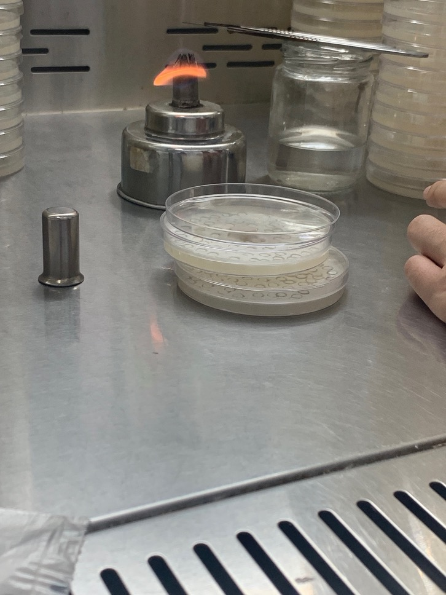
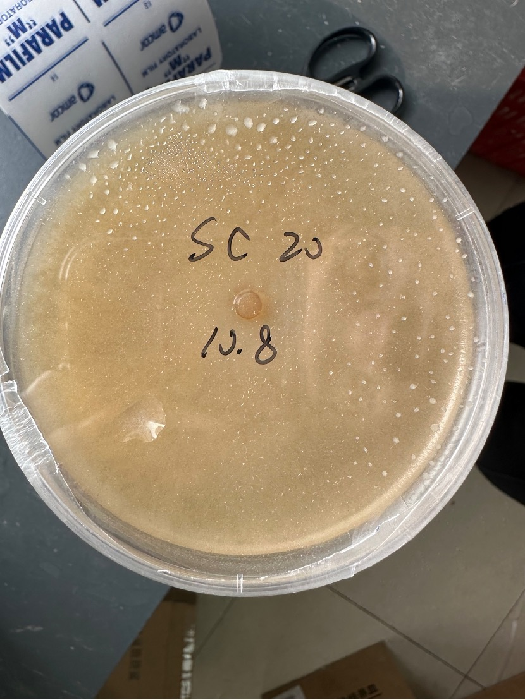
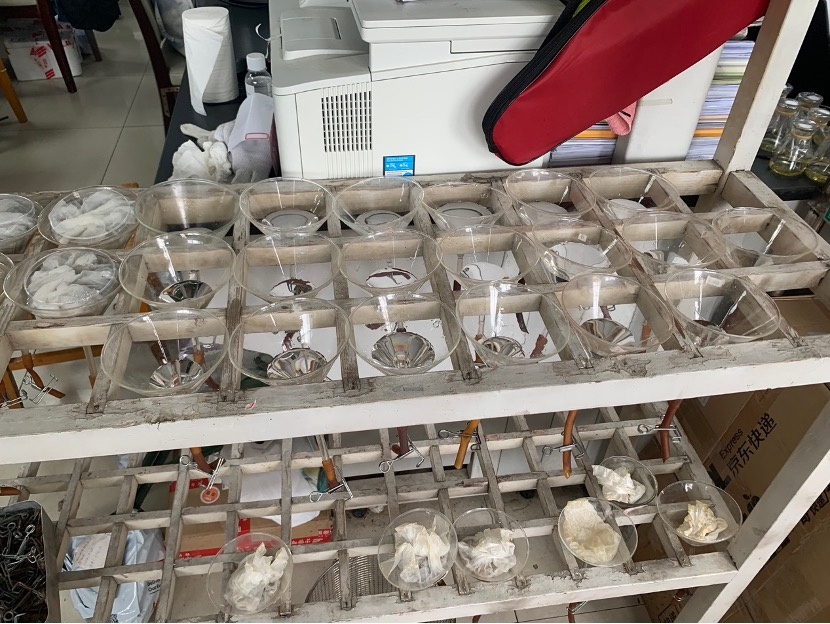
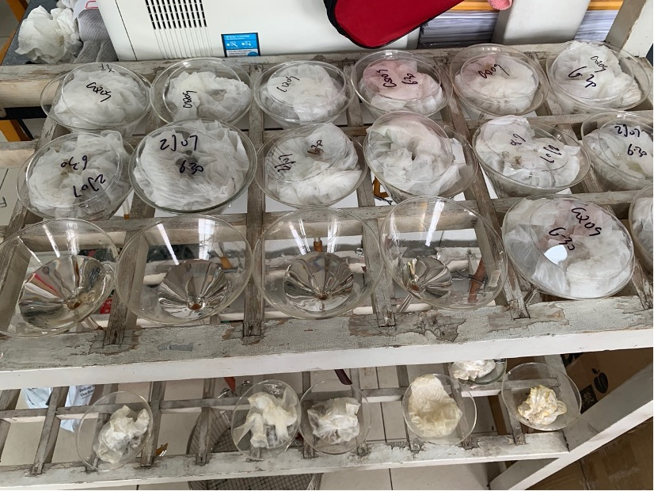
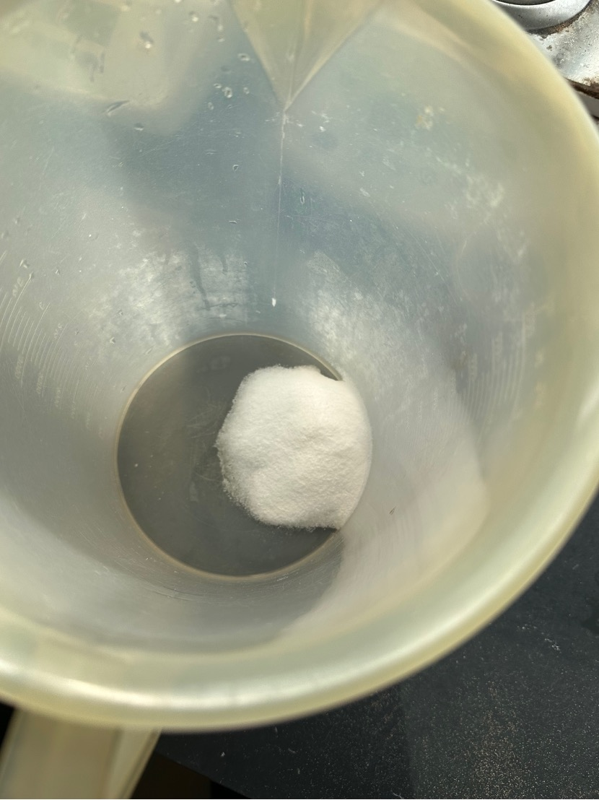
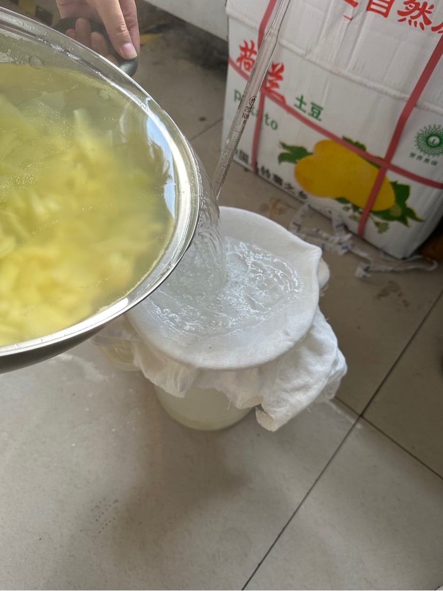

# Inoculation with Botrytis cinerea

Botrytis cinerea is the main food of pine wood nematode and is used to culture pine wood nematode in the laboratory.

Cut the petri dish with Botrytis cinerea into pieces with a scalpel. Use a scalpel or a pick needle to pick up a small piece of mycelium and culture medium. Place it upside down on a clean and uncontaminated PDA culture medium. Place the inoculated culture The medium is placed in an incubator for culture, and after Botrytis cinerea has grown completely, the medium is inoculated with pine wood nematode.

Perforated Botrytis cinerea medium for inoculation

Completed inoculated PDA culture medium

## Preparing pine wood nematode for experimental inoculation

Take out the cultured petri dish from the incubator. The Botrytis cinerea previously cultured in the petri dish has been completely eaten. This time, the pine wood nematode samples come from a total of 17 batches.

Some Petri dishes of SC 20

Operation: After disinfecting the operating table, spread a few napkins on the table, scrape off the gel-like culture medium in the petri dish with the tip of the pipette, spread it on the napkin and wrap it, and then put it with a rubber tube underneath. and was clamped into the funnel

The funnel on the right is sterilized and used for this experiment.

The rubber tubes under the funnel are clamped

Add autoclaved water to the funnel and set aside

Place the wrapped petri dish and napkin in the funnel, rinse the lid of the petri dish with sterilized water and pour it into the corresponding funnel. Be careful not to contaminate each other. Finally, use a batch marked with pine wood nematode. The petri dish lid is placed on top of the paper bag

Funnel draining nematodes

Label each funnel with the nematode batch marked and wait three hours

## Prepare solid culture medium

Prepare a total of 3200mL of culture medium

1. Cut raw potatoes over 720g

2. Wash, peel and chop into small pieces

3. Add more than 600mL of water to the pot to boil the rotten potatoes.

4. Add 72g glucose powder and dissolve

5. Strain with gauze and pour into a large beaker (plastic)

6. Use a measuring cylinder to take 900mL of medium liquid into a total of 5 Erlenmeyer flasks

7. Add 18g agar strips respectively to form a solid medium

8. Seal each seal and add to autoclave at 121 degrees Celsius for 20 minutes.