# **Configuring emulsion medicine**

This experiment mainly prepares harmful chemical solutions, so you need to take good protection, wear lab coats, gloves and masks to ensure that no harmful reagents get on the skin.

Use laboratory organic solvents and emamectin salts to prepare emulsion pesticides. Emamectin salt is an orange-yellow solid powder that is easily decomposed by light and is a highly effective pesticide ingredient. Emulsion is a type of pesticide that can effectively and long-term protect crops from pests and diseases, and is relatively less harmful to the human body. It is a relatively common type of pesticide at present.

To prepare an emulsion from pharmaceutical powder with unknown properties, you need to first use various organic solvents to try to dissolve the pharmaceutical. Since he was not sure about the characteristics of the solid powder emamectin salt, the brother added various organic solvents to try to dissolve it. He added alcohols, esters and hydrocarbons respectively, and finally dissolved the emamectin salt. After completing the dissolution, a solution was obtained.

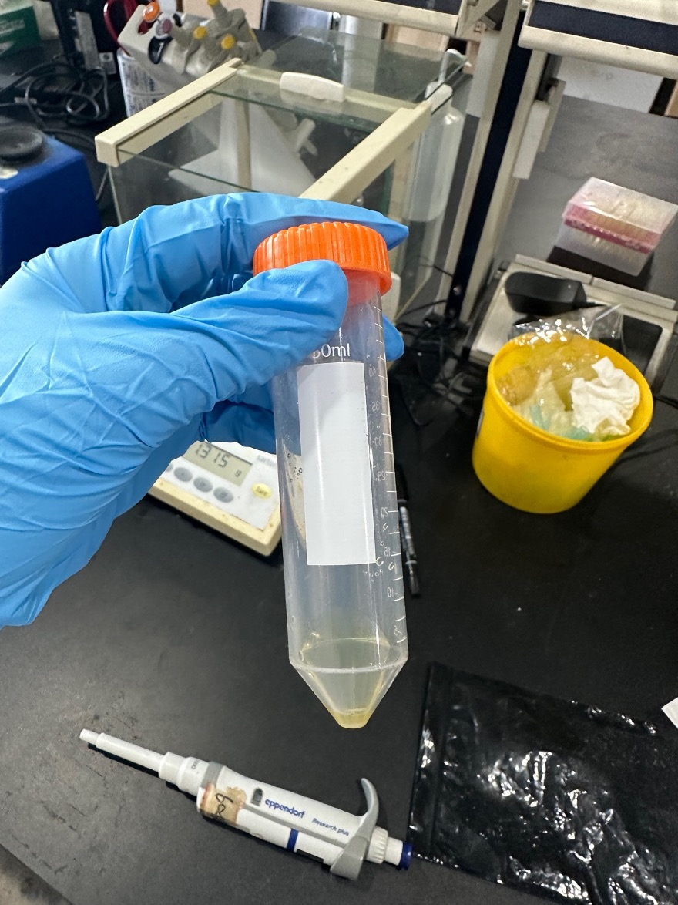

**The resulting solution**

The next step is to add the emulsifiable concentrate and use a vortex shaker to mix evenly to obtain an emulsifiable concentrate liquid.

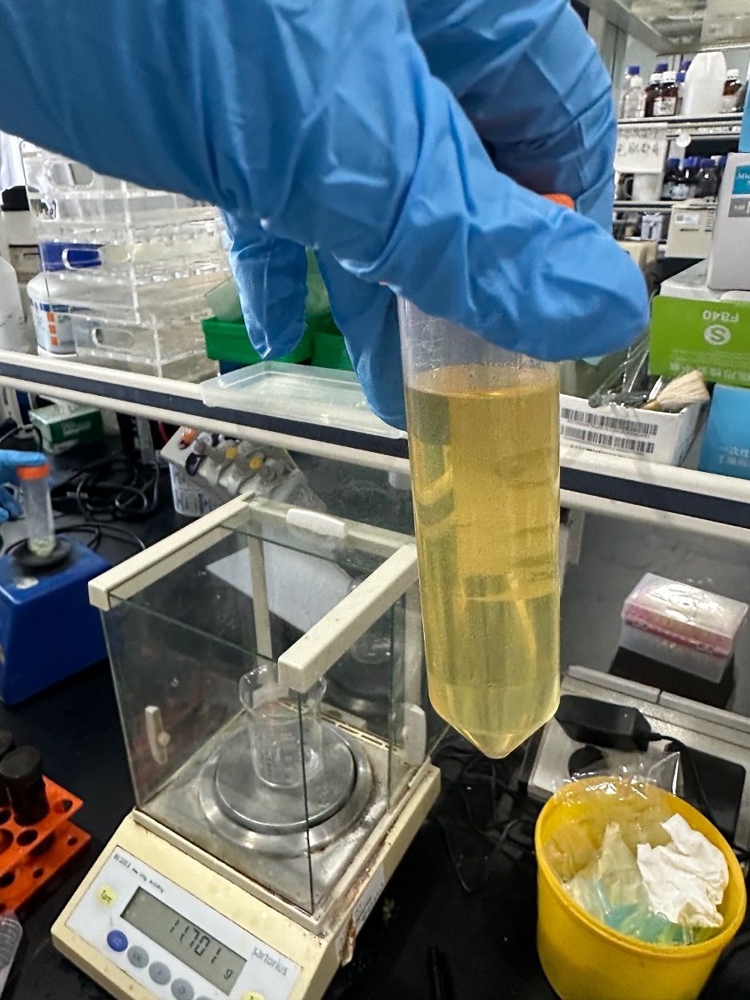

This is EC EL-40

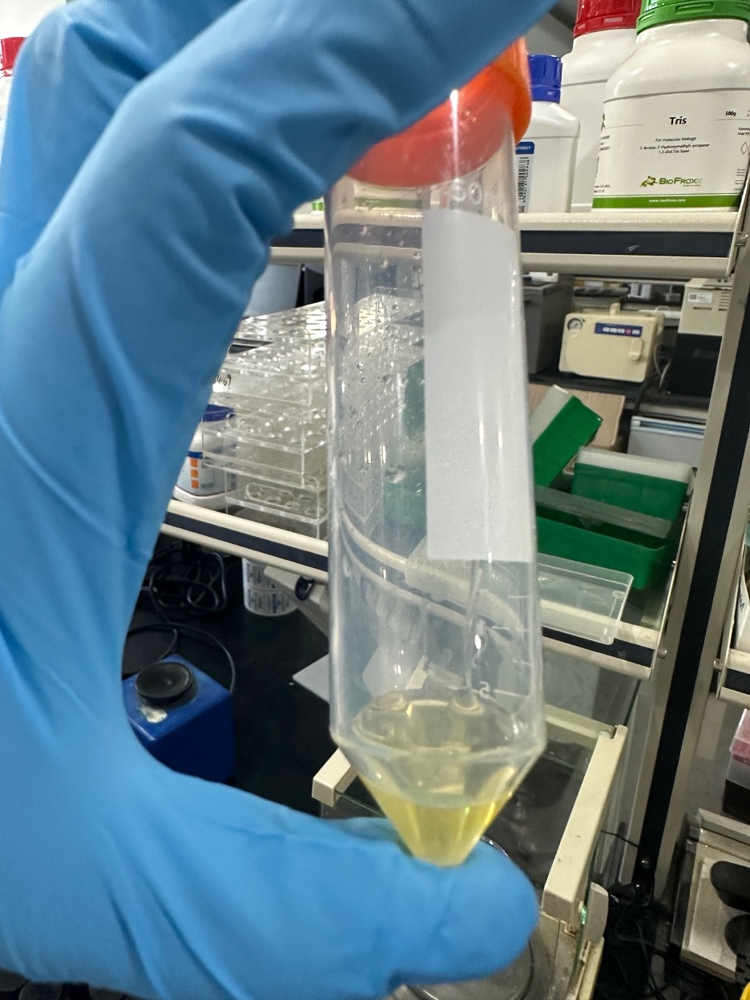

Add 2 mL of deionized water to the prepared emulsifiable concentrate and mix it in a vortex oscillator. A large number of bubbles will be generated and need to be removed with a defoamer.

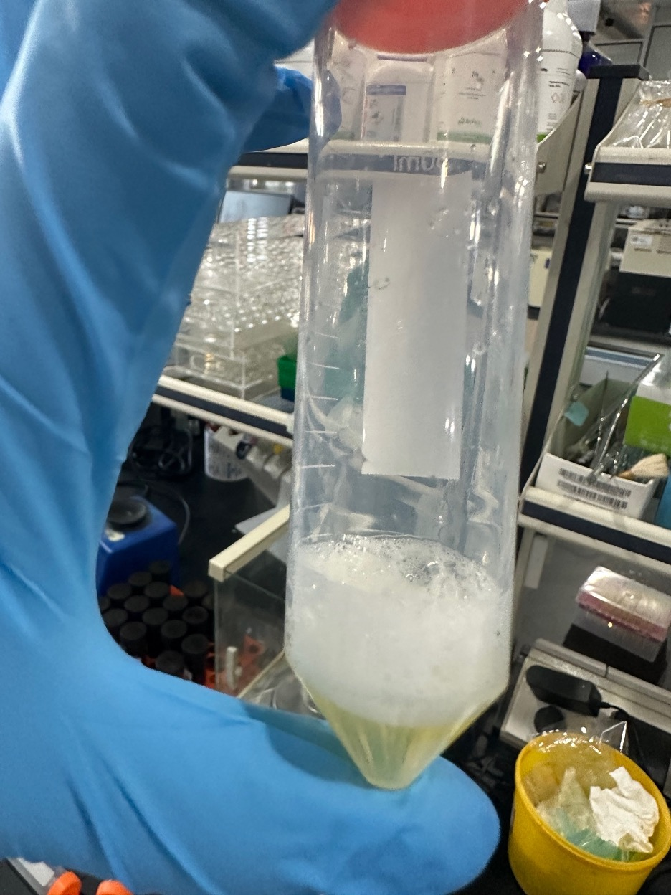

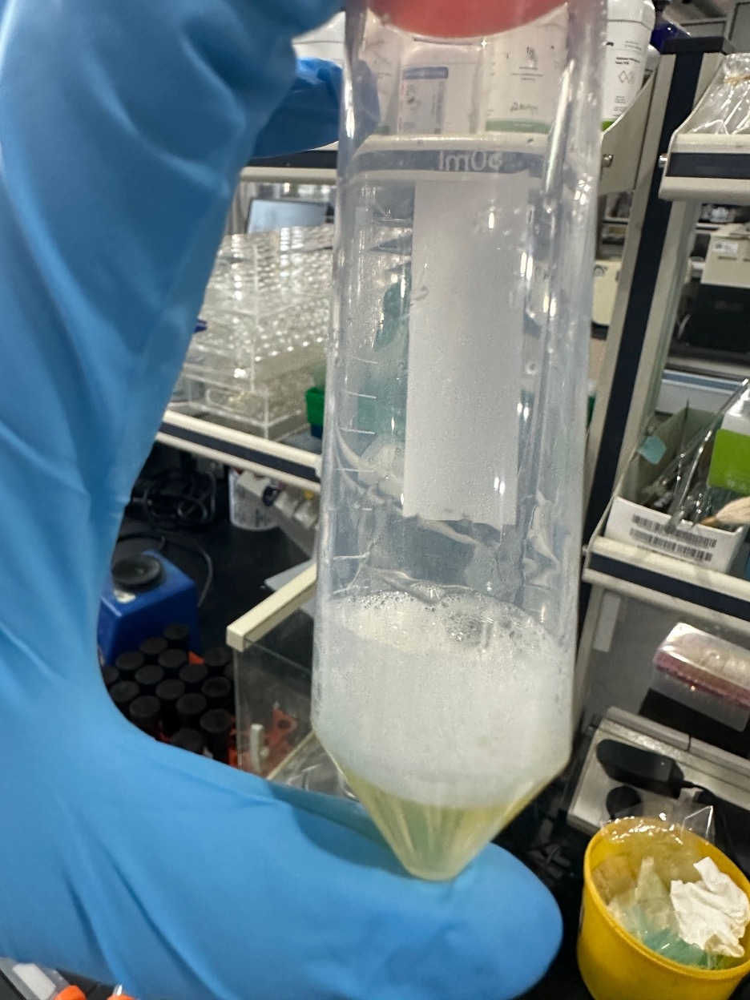

A lot of bubbles are produced

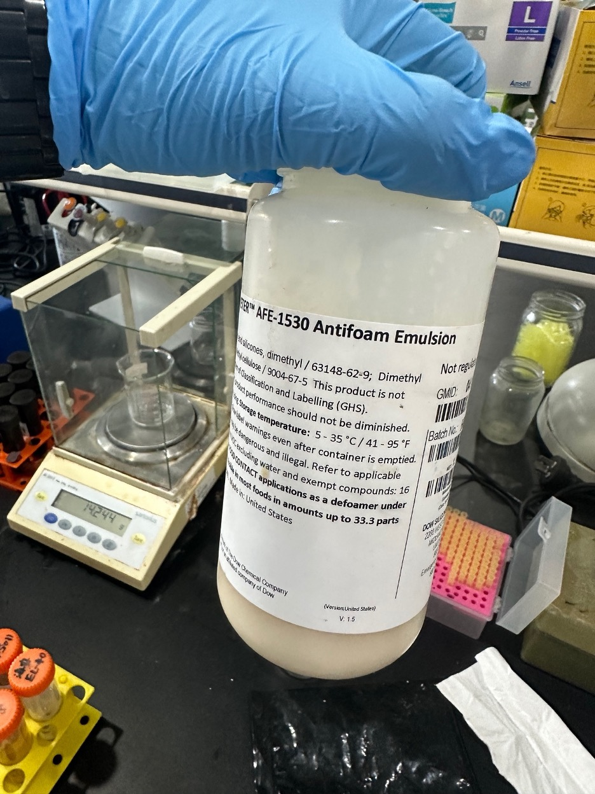

A can of defoamer mixture can remove all the foam with a very small amount

After defoaming, it was found that the liquid turned light yellow and very small droplets could be observed suspended in the emulsion.

Take out 1mL of the emulsion and add 100mL of deionized water for inspection. It is found that the liquid is completely transparent with only an almost imperceptible light blue color, indicating that the configuration is successful.

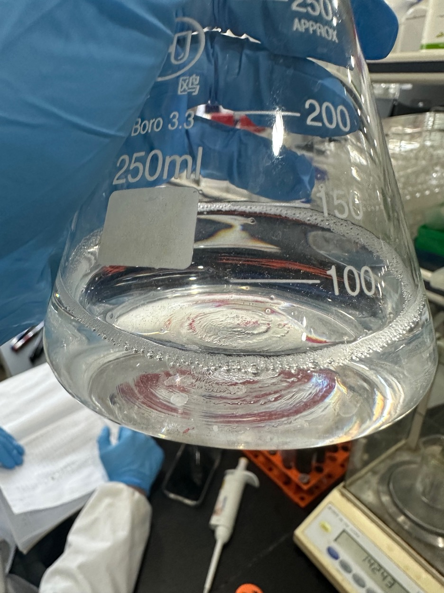

Very successful sample

The drug content of this sample is approximately 3.3%

When I started to prepare the medicine, I first chose 0.4g of decylamine, but the dissolution effect was not good.

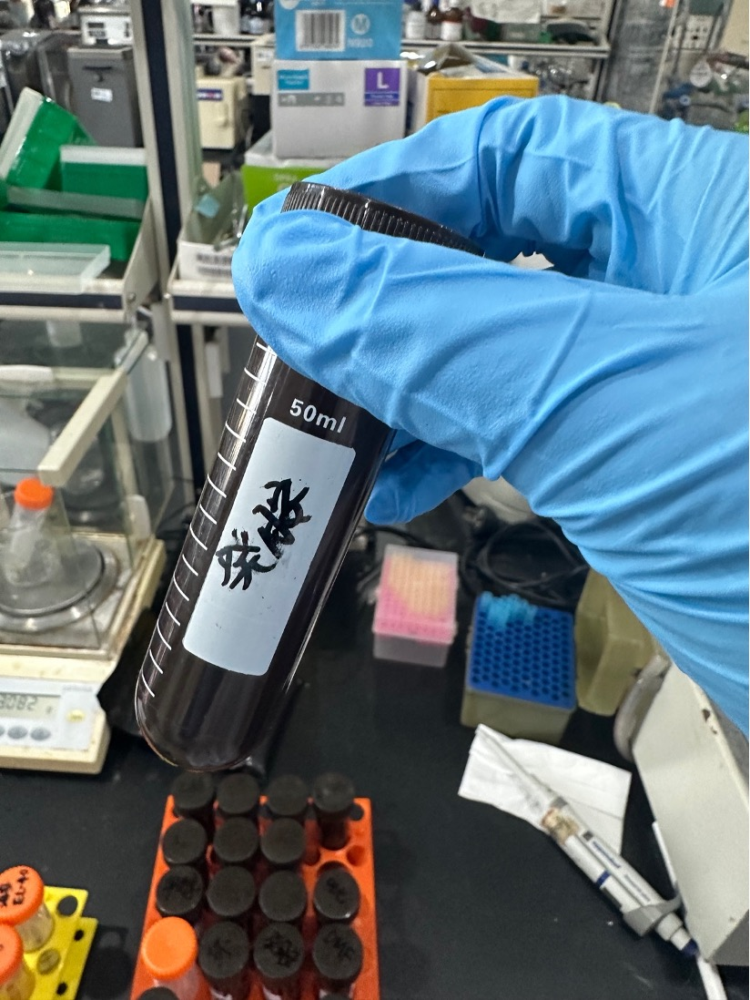

Then 0.4g of diethylene glycol butyl ether was added, but it was still not completely dissolved.

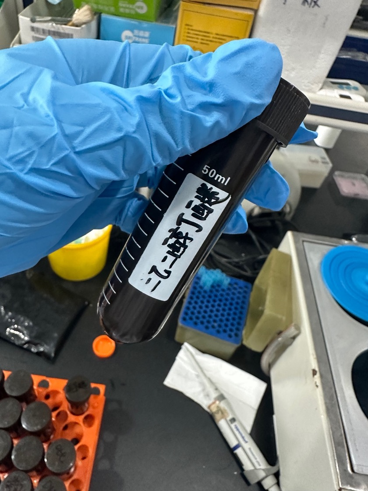

Then add 0.4g of valerolactone, there is still a small amount of floc that is not dissolved.

Finally, 0.4g methanol was added to completely dissolve the

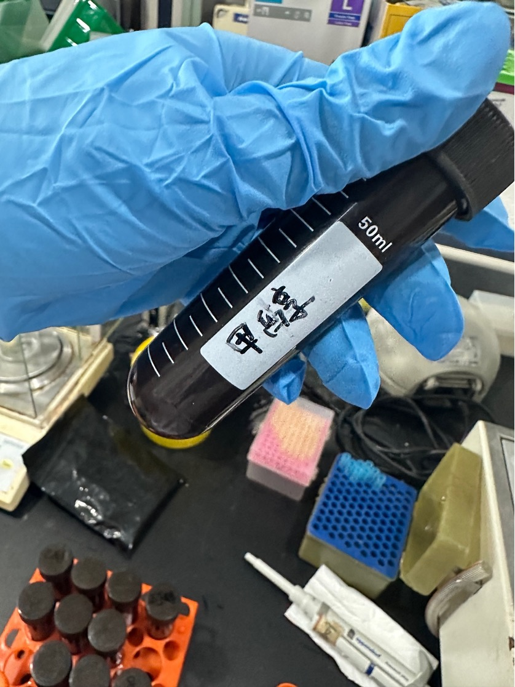

Add EC EL-40 0.4g

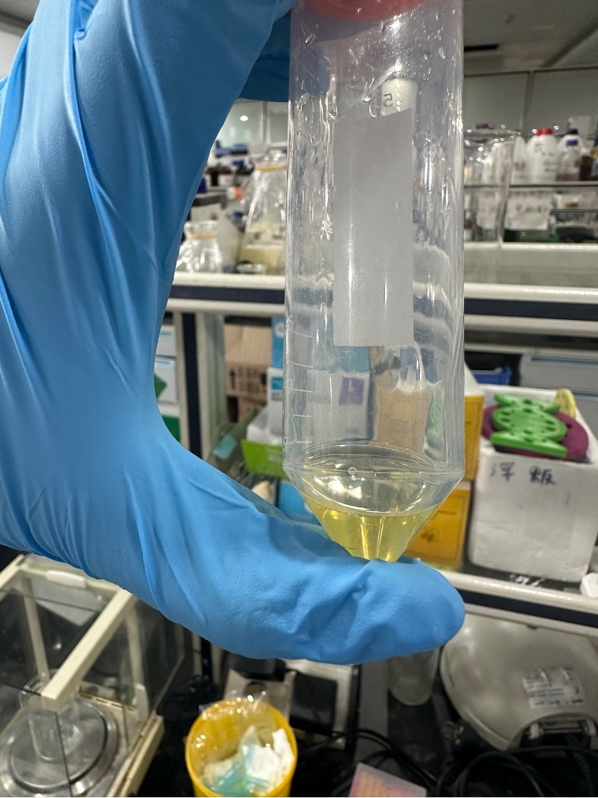

It seems that the effect is okay so far. Continue to add deionized water to make an emulsion.

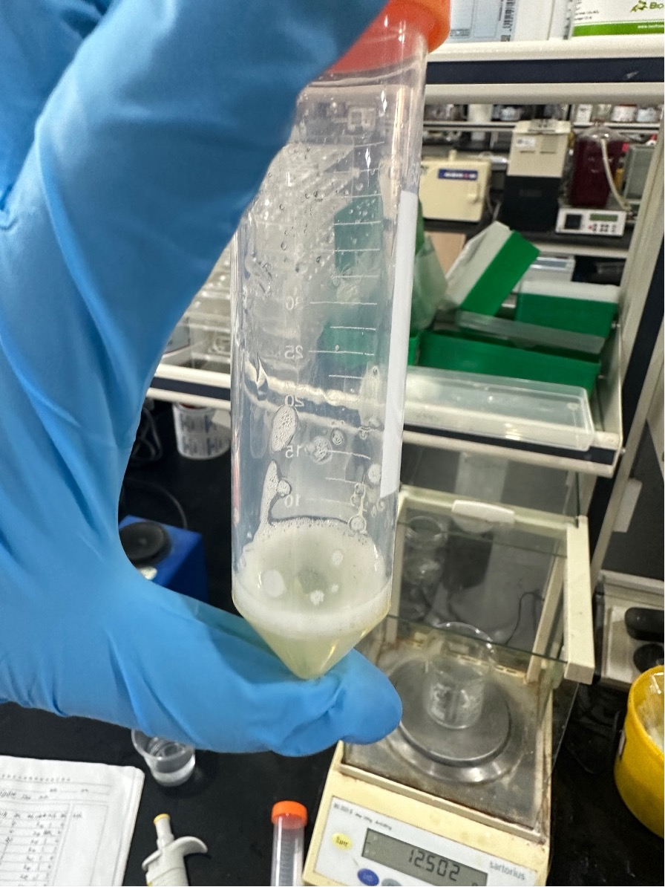

At this time, the emulsion was not clear enough. I tried adding a defoaming agent and a small amount of n-butanol to restore the pharmaceutical state, but failed.

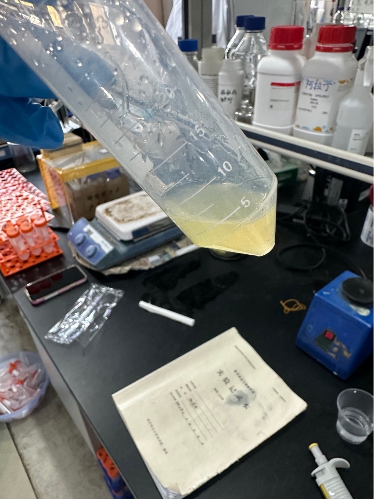

The medicine is not clear enough and does not improve after leaving it for a while. The medicine configuration failed.

situation analysis

A variety of organic solvents with unfamiliar properties were added together. Among them, diethylene glycol butyl ether may have reacted with other solvents to produce denaturation. Further research is needed to understand the specific reasons.