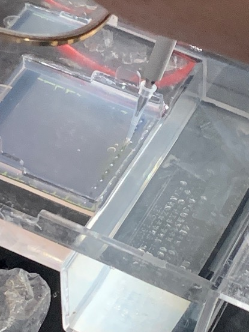
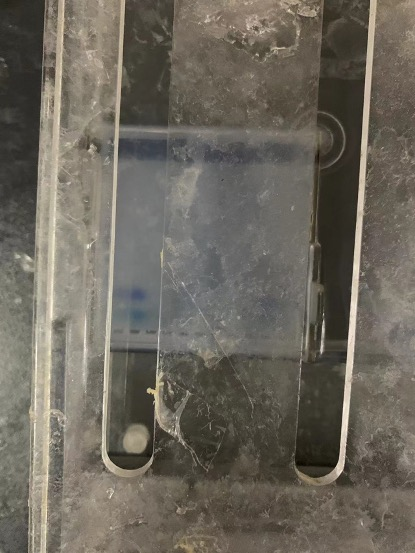

# Make agarose gel

Add 25 mL of TAB electrophoresis buffer to 0.25 g of agar powder, and heat it in a microwave for 1 minute to melt the agar. Add a drop of dye for easy observation. Pour it into the mold box and insert the "comb" for opening holes to facilitate parallelism. Add the measurement sample and wait for the agarose gel to solidify before taking out the "comb" to form a row of parallel openings.

Transfer the liquid to the opening of the agar gel through the pipette, and add the marker to the leftmost opening. Note that when adding the liquid, you need to tilt it slightly and add it slowly to prevent it from overflowing the opening and affecting the experiment if it is added too quickly. Also, be careful not to puncture the gel. glue.

Place the agarose gel in the electrophoresis apparatus with a voltage of 150V, a current of 200mA, and a time of 20 minutes.

Take out the completed liquid and gel together and place them in a gel imager for observation

The experiment is quite unsatisfactory because the current primers in the laboratory are not suitable enough. Although the displayed band positions are very close, the marker bands are stuck together and the specific number of DNA bases cannot be seen. The experiment may need to be redone.