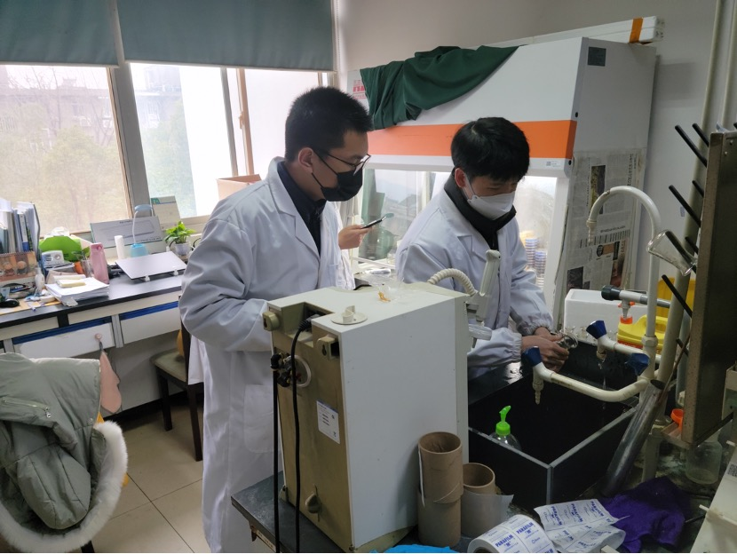
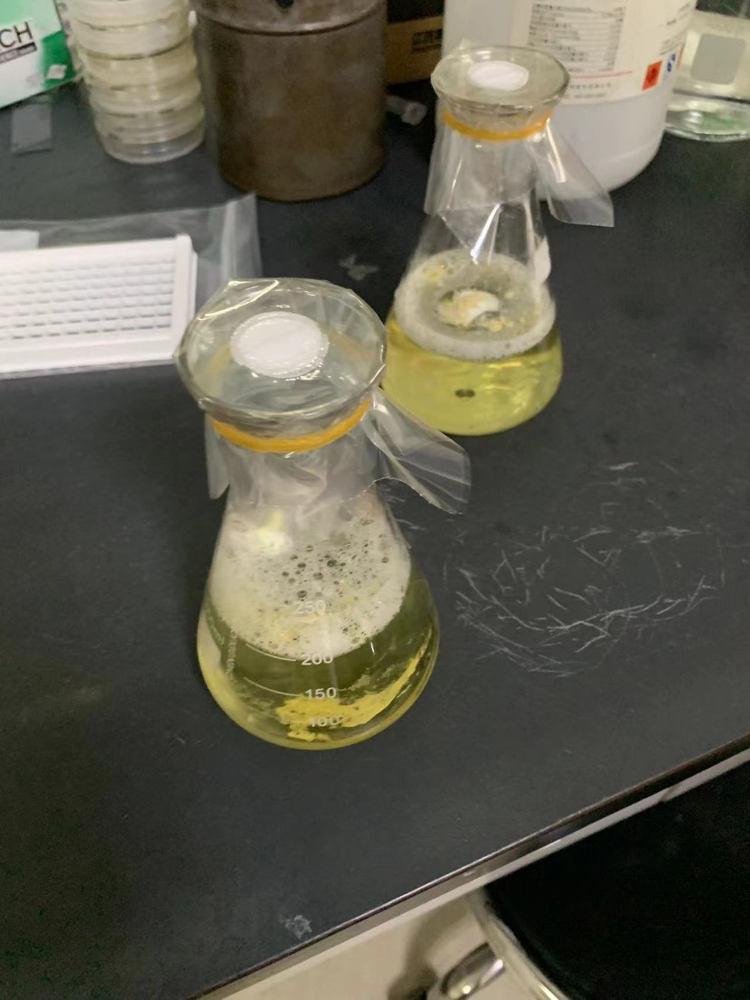
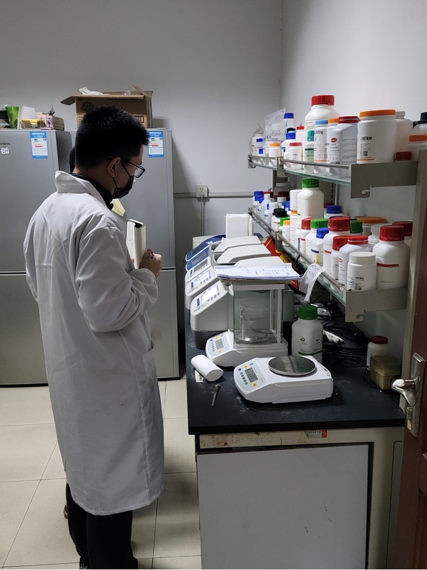
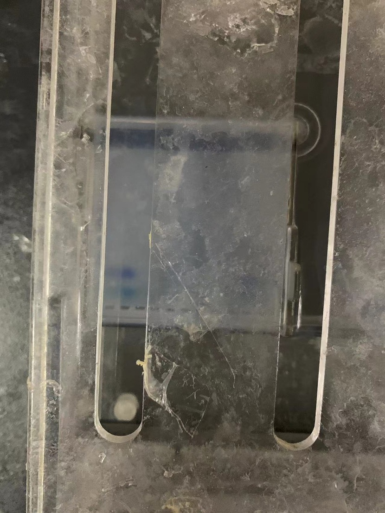
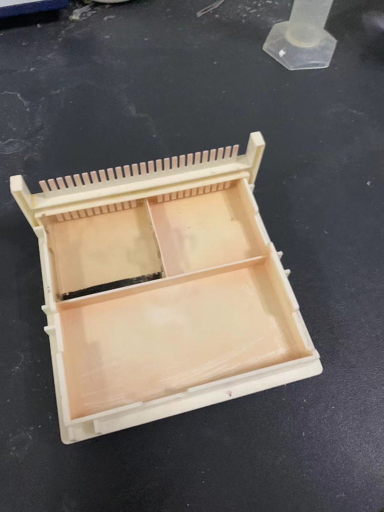

# LB medium preparation

Two 250mL Erlenmeyer flasks

Sodium chloride 2g (white powder)

Yeast extract 1g (white powder)

Tryptone 2g (orange powder)

Distilled water 200mL

1. Use a large test tube brush to clean the two Erlenmeyer flasks and dry them after washing

2. Use the electronic scale to weigh the three drugs and pour them into the Erlenmeyer flask.

3. Use two layers of sealing film to seal the bottle and tie the mouth of the bottle with a rubber ring.

   Mark the mouth of the bottle: liquid name, date and personal markings

4. Sterilize in an autoclave at 121 degrees Celsius for 20 minutes

   Dangerous equipment, improper operation may explode, for observation of graduate students' operation

   Add distilled water to the pot until it reaches the predetermined line, and check whether the waste water tank has too much or too little water.

   When opening, wait until the pressure gauge returns to zero and the temperature in the pot is lower than 90 degrees Celsius.

5. Place the finished product on the shelf for later use

## Nucleotide number determination of Auh3 DNA fragments

Auh3 fragment standard data is 828 nucleotides

Configure 50µL

Sterile water 20.5µL

Enzyme solution 25µL

Primers (1µL each of forward and reverse direction solutions)

DNA template fragment 100ng (solution 2.5µL)

1. Use a pipette to put various liquids into a tube of eight consecutive tubes and close the cap.

2. Place the eight-tube tube into a low-speed centrifuge and stir for 30 seconds.

3. Place the tube into the PCR machine setting program

| Process | Pre-denaturation | Denaturation | Melting | Expansion | Insulation | Open the lid and take out |
| ----------- | ------ | ---- | ---- | ------------------- | -------- | -------- |
| Temperature/Celsius | 95 | 95 | 60 | 72 | 72 | 10 |
| time/second | 300 | 15 | 15 | 45 | 420 | / |
| Loop/time | | 32 times | | | | |
| Remarks | Preheating | | | Extend/shorten according to reagent volume | Maintain temperature | |

4. Add 1µL of dye to an empty space in the eight-strip tube, add 1µL of prepared solution into the dye and mix well.

5. Pour the liquid into the opening of the agar gel, place the control solution in the opening next to it and place it in the electrophoresis apparatus.

   Voltage 150V, current 200mA, time 20 minutes

6. Take out the completed liquid and gel together and place it in the gel imager for observation

   The left side is my operation, the right side is the graduate operation, the result on the left is slightly vague but the conclusion is correct

Discovery: The number of nucleotides in the Auh3 fragment ranges from 750 to 1000

**Test successful**

## Other operations

### Learn to use a pipette

1. Put on the pipe head

2. Adjust the suction volume

3. Remove the air from the air and put it into the liquid to absorb the liquid.

4. Press the button to the bottom to squeeze out all the liquid in the tube to be tested. It needs to be attached to the bottom of the tube or extended below the liquid level. After taking it out, release the button in the air to suck in air.

5. The tube head needs to be replaced when replacing the sucked liquid.

6. After use, adjust the suction volume to the maximum position to protect the internal spring structure, and hang it on the designated position on the shelf.

### Make gel

0.3g 15% concentration agar

20mL GAE solution (poisonous, for observation of postgraduate operations)

1. Dissolve by heating

2. Add a drop of dye

3. Pour the offset plate and insert the "comb", wait for solidification and take out the "comb"

4. Put it into the electrophoresis apparatus. The electrophoresis apparatus contains GAE solution.

### Petri dishes with culture media sealed on a super clean workbench

The workbench is sterilized by ultraviolet light. Hands need to be disinfected when using them. Hands need to be re-disinfected after being taken out.

Use a strip of elastic material to seal the Petri dish. Note that it needs to be sealed twice.

Use 8 failed Petri dishes to practice sealing, seal a good V8 Petri dish, and wait for two days to observe whether there is contamination to determine whether the sealing is successful.

On 2.21st, another inspection found that the culture medium was not contaminated and the operation was successful.

The workbench needs to be disinfected after use
