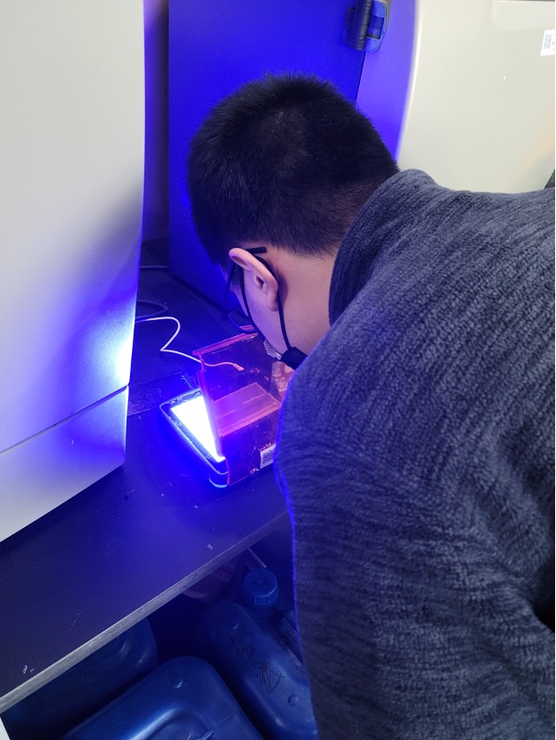
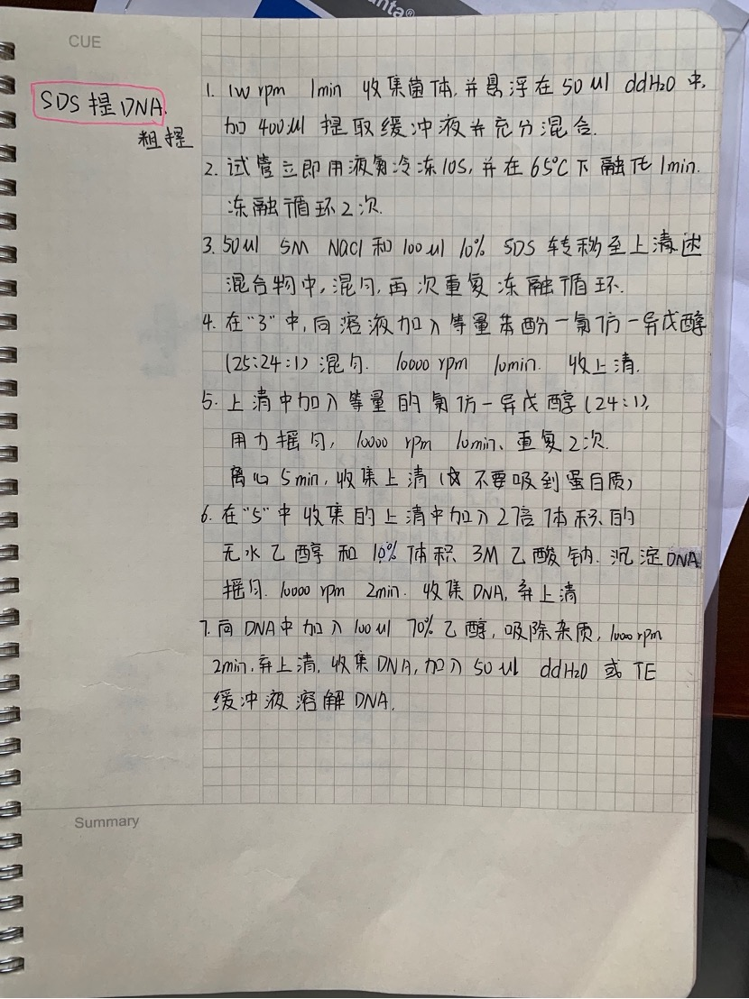
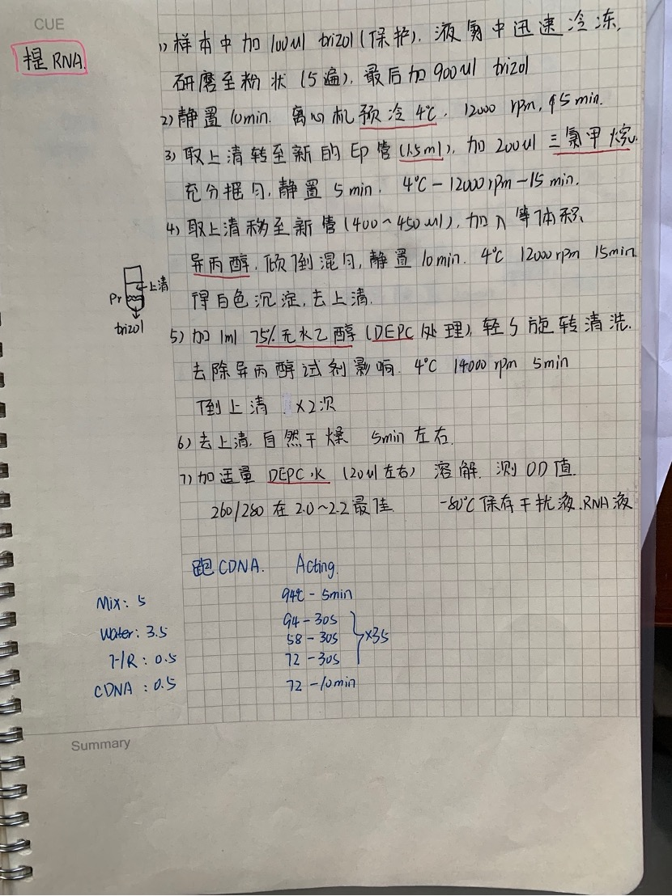
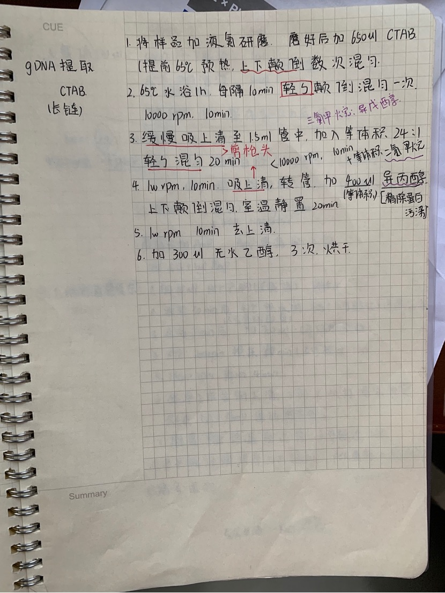
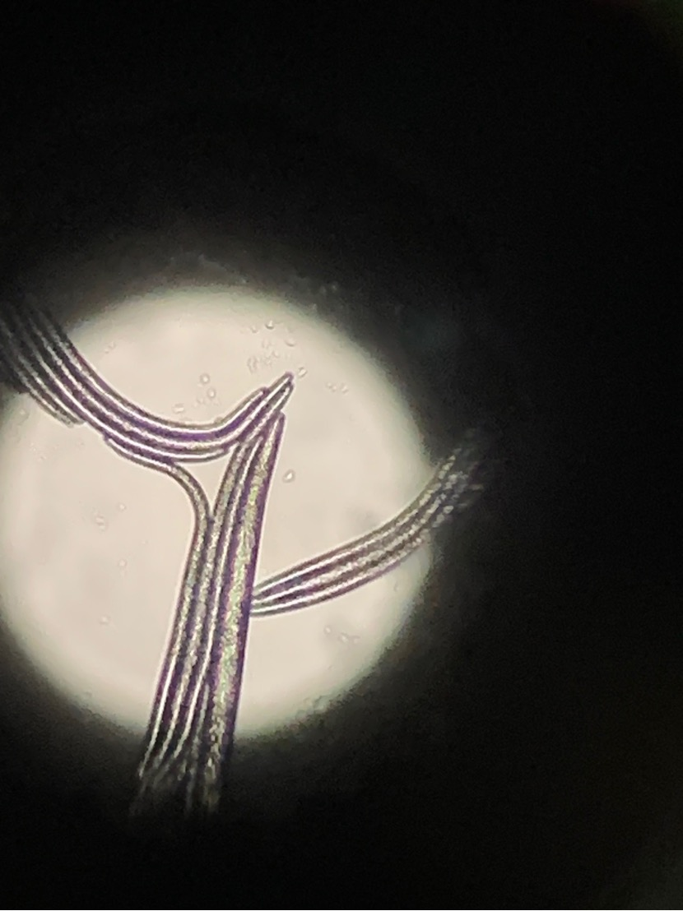

# Gel cutting and recovery of amplified DNA fragments

1. Observe agarose gel using G:BOX gel imaging system

Discovery: DNA 0 has base pairs 700

DNA number 4 has base pair 438

1. Use a 1.5mL centrifuge tube to load the cut gel and weigh it.

> Found that No. 0 is 0.53; No. 4 is 0.43g; the target gel piece I cut is 0.77g
>
> The gel block is too large, which affects subsequent operations, indicating that the operating level needs to be improved and needs practice.

2. According to 100mg gel corresponding to 100µL buffer GDP, add the corresponding amount of buffer GDP into the centrifuge tube.

> Buffer GDP is an orange-yellow liquid

3. Place the gel tube on a metal heater to heat it until the gel is completely dissolved

> You can take it out and pour it out every once in a while to facilitate dissolution.

4. Centrifuge for a few seconds to allow the liquid to return to the bottom of the centrifuge tube, and place the adsorption column in another collection tube (do not touch the wall of the adsorption column)

5. Move the liquid into the adsorption column. The liquid volume should not exceed 700µL. If it exceeds, it should be placed in multiple tubes.

6. High-speed centrifuge rotates at 12,000 rpm for 60 seconds

> Pay attention to the internal balance of the centrifuge

7. Discard the filtrate in the collection tube, absorb it with paper towels, add 300µL buffer GDP, and let it sit for 1 minute.

8. High-speed centrifuge rotates at 12,000 rpm for 60 seconds

9. Discard the filtrate in the collection tube, absorb it with paper towels, and add 700µL buffer GW (absolute ethanol has been added)

10. High-speed centrifuge rotates at 12,000 rpm for 60 seconds

11. Repeat steps 10 and 11

> Repeat twice to effectively clean the salt on the pipe wall

12. Discard the filtrate and place the adsorption column in another collection tube.

13. High-speed centrifuge rotates at 12000rpm for 120s

> Used to completely remove the liquid in the adsorption column

14. Place the adsorption column in a sterilized centrifuge tube, add 30µL elution buffer, and let stand for 2 minutes.

> Do not touch the filter membrane of the adsorption column when adding liquid dropwise
>
> Elution buffer is used here to dissolve DNA

15. High-speed centrifuge rotates at 12000rpm for 60s

16. Store the product at -20 degrees Celsius

## Understand the main steps and principles of PCR operation

 **SDS crude DNA extraction** 

 **SDS extracted RNA** 

Extract long-chain gDNA

Try to learn relevant principles, organize questions, and ask them in the next experiment

## Observe pine wood nematode under the microscope

Pine wood nematode is the cause of pine tree disease. It does not exceed 1mm in length, but it can cause devastating pine wood nematode disease, causing the entire pine tree to die and rot.

The pine wood nematode is divided into male and female. The female has a structure called the operculum on the tail, and the male has a copulatory spine on the tail, which is used for reproduction. The pine wood nematode has a slender stylet on the head, which is connected to the middle esophageal ball below.

## Configure 1x electrophoresis liquid

1. Add 20mL of 50x electrophoresis solution into a 1L round-bottomed flask (wear gloves when handling toxic reagents)

2. Add sterile water to the 1L mark in the flask

3. Close the lid and shake well