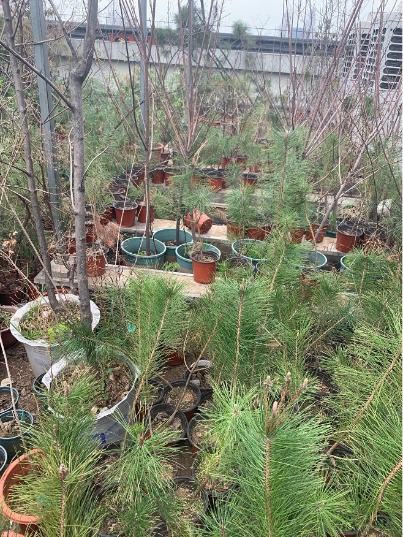
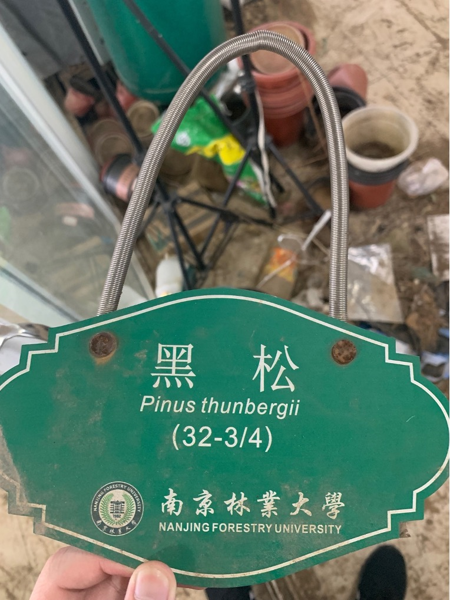

# Forest planting greenhouse (14:30-17:00)

## **1.** Observing the growing experimental pine saplings

### 1. Learn to recognize masson pine and black pine trees

Learn to recognize masson pine and black pine trees

The cultivated black pine saplings for experimental use have been growing for more than a year.

 

Black pine introduction sign on campus

### 2. Observe diseased pine trees to understand the symptoms of various stages of pine wood nematode disease

​In the early stages of pine wood nematode disease, the pine needles will lose their green color, and then the pine needles and surrounding bark will turn yellow, and there will be traces of beetles and beetles laying eggs on the tree.

​In the later stages, the pine tree will no longer secrete rosin at all and the needles will turn a fiery red color. The diseased pine tree will die within two months.
 

Black pine seedlings artificially diseased and dead during the experiment 

### 3. Learn how to artificially inject pine wood nematode into pine seedlings

- Open a 2-3cm opening in the tree. Open to the cambium layer. Do not cut the core material, otherwise the sapling may be easily broken. Fix a cotton ball at the opening, wrap it with plastic film on the outside, and add a predetermined amount to the cotton ball. Water the saplings with a quantity of pine wood nematode sap. Be careful to add it directly to the soil and do not pour it on the trunk and pine needles.

- Add sterile water to the cotton ball the next day
  
- Water the diseased tree once every two days and observe the condition of the diseased tree once a day
  
- Cut down saplings on specific days to take samples for observation

## **II.** Learn some theoretical knowledge of DNA analysis

- 1. Ct value: How many cycles are needed during artificial amplification so that the expression level reaches the peak and no longer increases sharply

The smaller the Ct value, the earlier the expression level will start to increase rapidly when amplifying DNA, and the final expression level will be higher.

- 2. Dissolution temperature: At what temperature does the target gene (cDNA) reach the maximum amount of dissolution?

​ If this temperature is less than 80 degrees Celsius, it means that primer self-ligation has occurred (the primer fragments that should have been attached to both sides of the target gene have adhered to themselves, forming some short sequences of about 30 bp)

​ If the temperature is higher than 85 degrees Celsius, it means that there is contamination from other genomes, and an operation called "de-g DNA" should be used.

- 3. Generally, the actin gene (actin) is used as the internal reference gene in the experiment (for comparison with the target gene)
- 4. Set the control group on the data (for example, in the pine wood nematode infestation experiment, the control group (ck) is the one that is not inoculated, and the treatment group is the one after inoculation)
