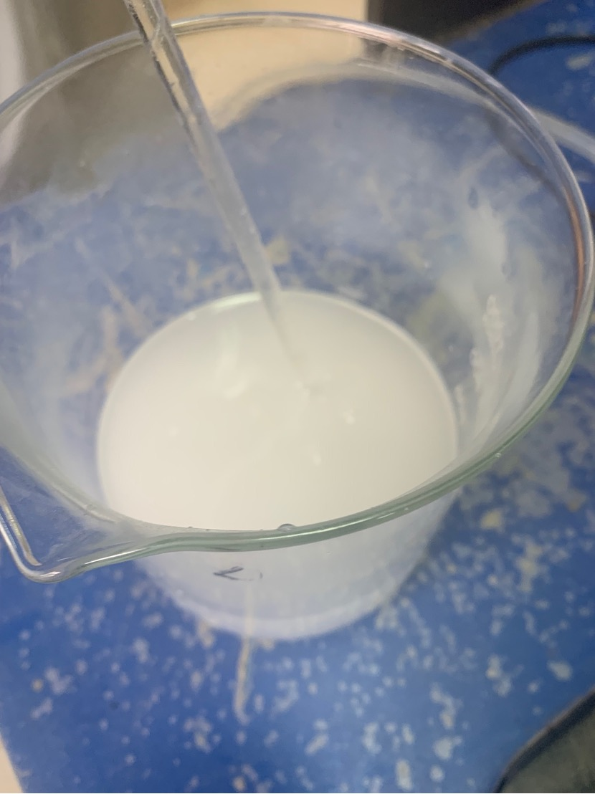

## 1. Prepare 1mol/L ammonium acetate solution

- Weigh 77.08g ammonium acetate solid (volatile)

- Add 400mL of water to completely dissolve

- Pour the liquid into a 1L volumetric flask

- Rinse the beaker used for dissolution 7 times with distilled water

- Add volumetric flask to the mark and seal with parafilm

- Stir well

Experimental operation introduction page

Prepared ammonium acetate solution

## 2. Prepare 10mol/L sodium hydroxide solution

- Weigh 400g of sodium hydroxide solid (dangerous, should be handled with gloves)

- Add 500mL of water to completely dissolve and return to room temperature

- Pour the liquid into a 1L volumetric flask

- Rinse the beaker used for dissolution 7 times with distilled water

- Add volumetric flask to the mark and seal with parafilm
1. Stir evenly

Undissolved sodium hydroxide solution

## 3. Prepare solid medium

### Experimental purpose: To study the effect of riboflavin (vitamin B2) concentration on the growth of Mortierella fungus

#### Preparation: Prepare solid culture medium

Data collection: The molar mass of riboflavin is 376.37g/mol

Mother liquor preparation: 10mL of 0.1mol/L riboflavin solution

-Weigh 3.76g riboflavin

- Add 8mL water to dissolve

- Add 2mL of dilute sodium hydroxide solution to accelerate dissolution

- After dissolving, it becomes a dark yellow solution

Concentration gradient: 10-3, 10-4, 10-5, 10-6, 10-7mol/L

Quantitative calculation: C1V1=C2V2

A draft of the calculation

| Concentration mol/L | /(control group) | 10-3 | 10-4 | 10-5 | 10-6 | 10-7 |
| ------- | ------ | ---- | ----- | ------ | ------- | -------- --- |
| Amount of mother solution added | / | 1mL | 0.1mL | 0.01mL | 0.001mL | 10mL of 10-6 solution |

The volume of mother solution required at 10-7mol/L is less than the minimum range of the pipette, so use a 10-6mol/L solution to dilute it ten times.

Prepare a total of 600mL of culture medium

- Cut raw potatoes over 120g

- Wash, peel and chop into small pieces

- Add more than 600mL of water to the pot to boil the rotten potatoes

- Add 120g glucose powder and dissolve

- Filter with gauze and pour into a large beaker (plastic)

- Use a measuring cylinder to take 100mL of medium liquid into a total of 6 Erlenmeyer flasks

- Add the previously calculated amount of riboflavin separately

- Add 1.00g of agar powder to form a solid medium

- Seal and add to autoclave at 121 degrees Celsius for 20 minutes