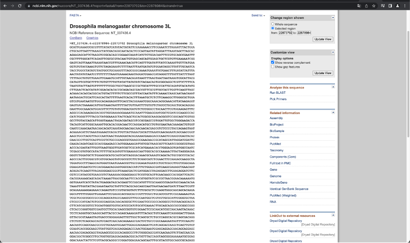

## Observe last week’s results

**Mycelium results**

After adding riboflavin, the growth status of Mortierella was significantly improved (compared to the control group on the left in the first row), but the effect of the added amount on the growth status of Mortierella was not obvious.

## Learn to design primers

1. Confirm the source organism, name and coding of the primers

> The names of genes may be the same, but the codes are unique. It is necessary to confirm that the gene from which the data is obtained belongs to the target gene.

2. Obtain the expression of this gene at NCBI (<https://www.ncbi.nlm.nih.gov/>)

> Get all nucleotide data via TASTA button
>
> 

3. Obtain a 20-30bp short fragment from a position that is not close to the front and end of the gene with a GC value of about 40% and an annealing temperature of about 55 degrees Celsius to obtain a starting primer.

> Auxiliary operations can be performed through some third-party programs

4. Use the same method to obtain the end primer. Note that the difference in annealing temperature from the beginning primer of the previous section cannot exceed 5 degrees Celsius.

5. Record the sequences of primers at both ends

> The end primer requires reverse expression

## Transfer seed liquid

The entire process needs to be completed on a super clean workbench

1.5L seed liquid in a two-liter Erlenmeyer bottle

Add the cultured mycelial bacteria liquid (i.e. 15mL) according to the volume of 1% of the seed liquid.

1. Hands need to be worn and disinfected with alcohol before entering the super clean workbench. The alcohol lamp can be lit only after the alcohol evaporates.

2. Open the sealing film of the bacterial solution, and bake the mouth of the small conical bottle containing the bacterial solution on the flame of an alcohol lamp to sterilize it.

3. Open the seal of the seed liquid and place the sealing film upside down on the workbench.

4. Use the flame of an alcohol lamp to sear the mouth of the conical bottle (be careful not to tip the bottle if it is heavy).

5. Grill the freshly sterilized pipette tips

6. Transfer 15mL of bacterial solution, please note that it needs to be shaken evenly before transfer.

7. Re-seal the two seed liquid bottles and cover the bacterial liquid bottles with sealing film. Grill them once before sealing.

8. You can continue to transfer jobs, the requirements are the same as before

9. After everything is completed, the workbench should be restored to its original state.