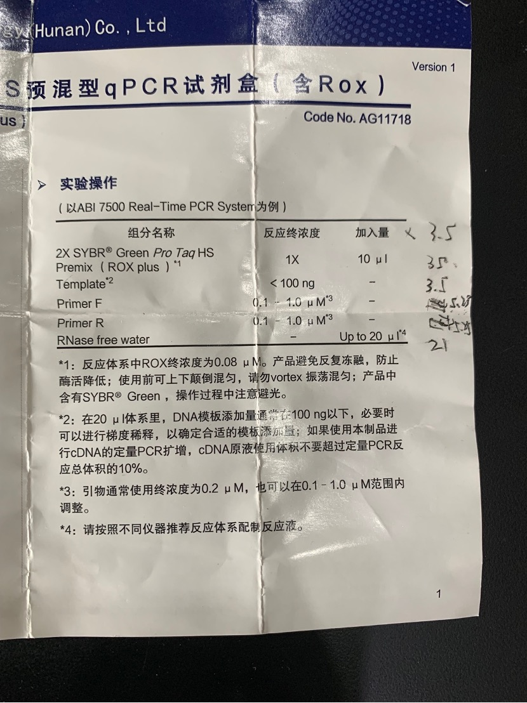
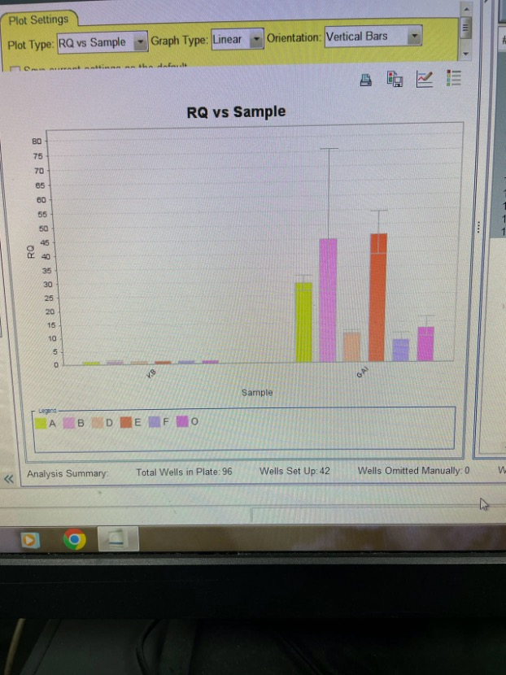
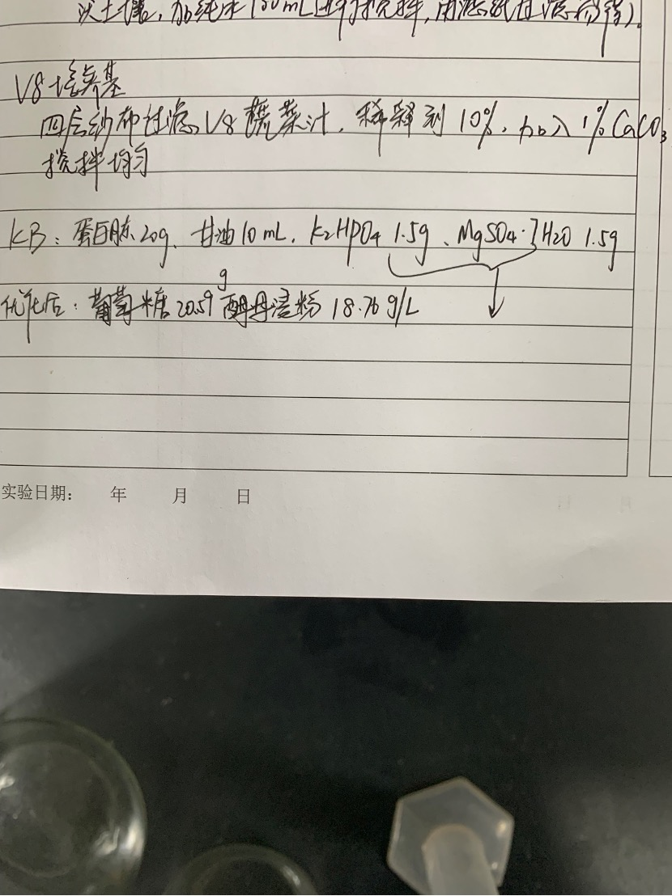

## Observe configuration q PCR

 

In order to improve the effect, the instructor will x3.5 the quality of all reagents.

1. The order of adding to the centrifuge tube: sterilized water, enzyme, template, primer.

2. After adding, put it into a centrifuge at 4 degrees Celsius and 12,000 rpm for two minutes.

3. Place on a shaker and mix for 15 seconds.

4. After adding, put it into a centrifuge at 4 degrees Celsius and 12,000 rpm for one minute.

5. Divide all solutions into three parts and add to the kit.

6. Seal the kit and centrifuge for 15 seconds.

7. Amplification on q PCR instrument.

> 
>
> Experimental results

## Configure KB medium and modified KB medium

1. Prepare 1L KB medium and 100mL modified KB medium respectively.

2. Weigh each medicine and add it to the beaker.

3. Add distilled water to completely dissolve and stir evenly.

When preparing KB culture medium, distilled water was mistakenly added to tap water, resulting in a large amount of foam on the culture medium, which was eliminated after long-term stirring.

4. Place in autoclave at 121 degrees Celsius for 20 minutes.