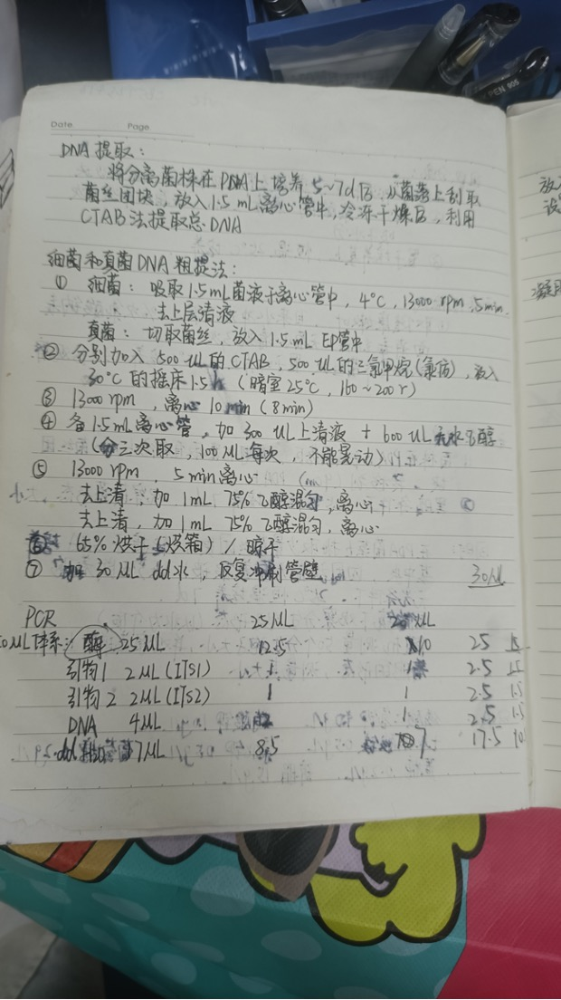
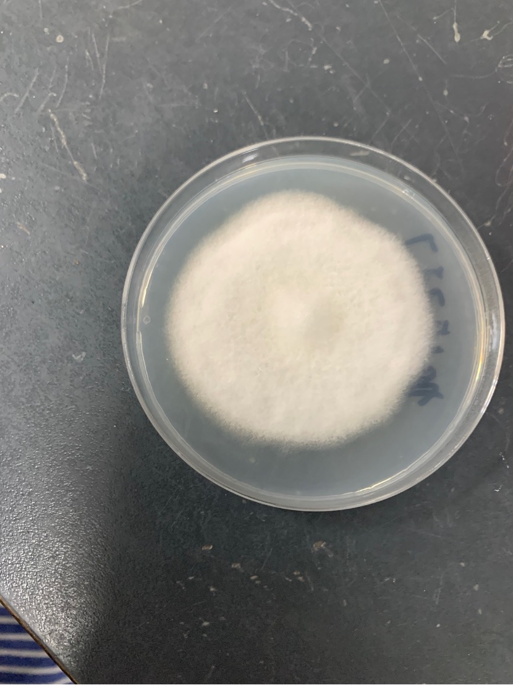
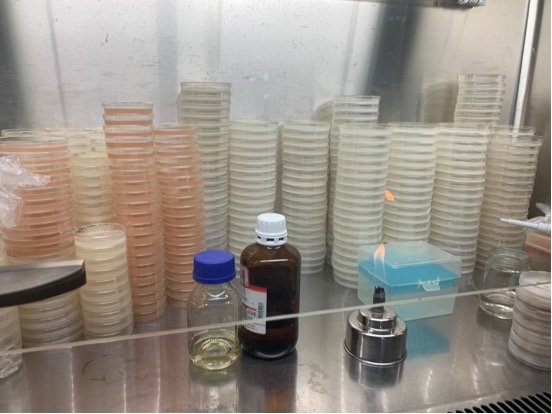
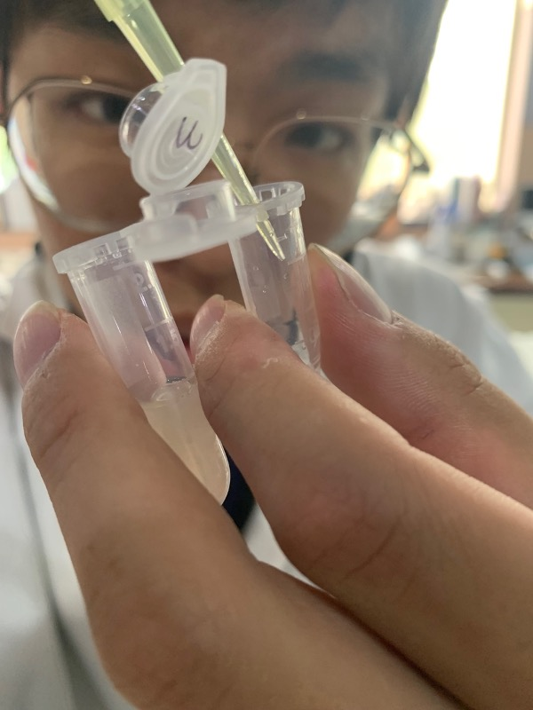
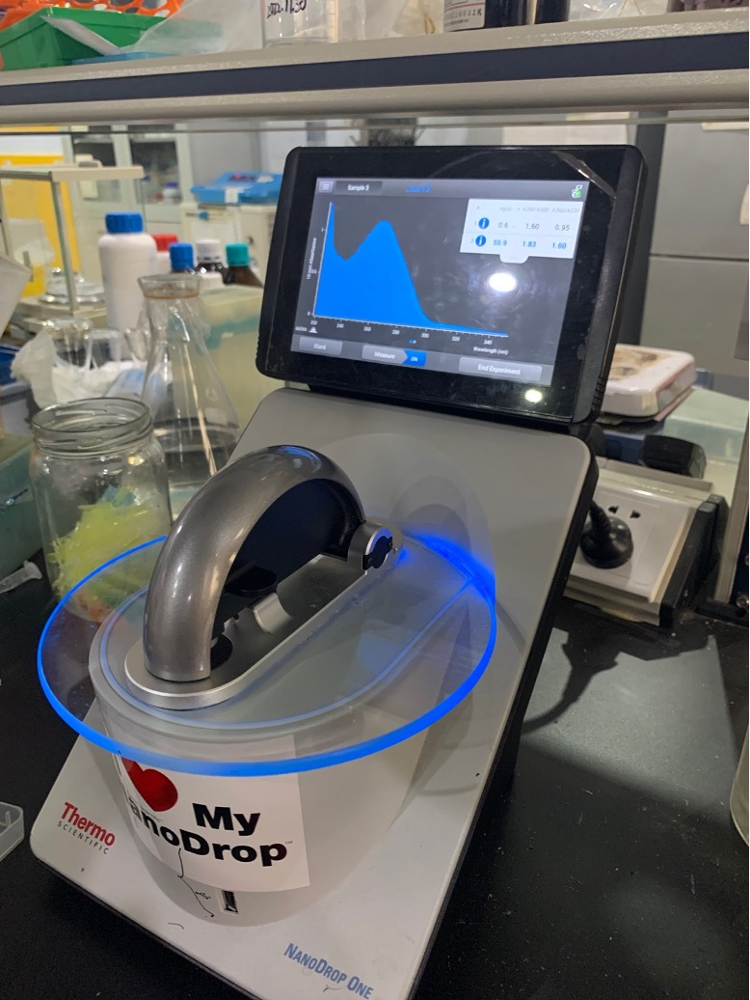
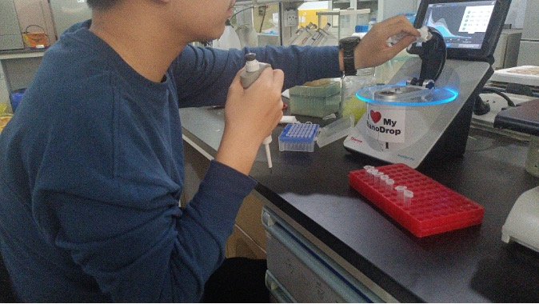
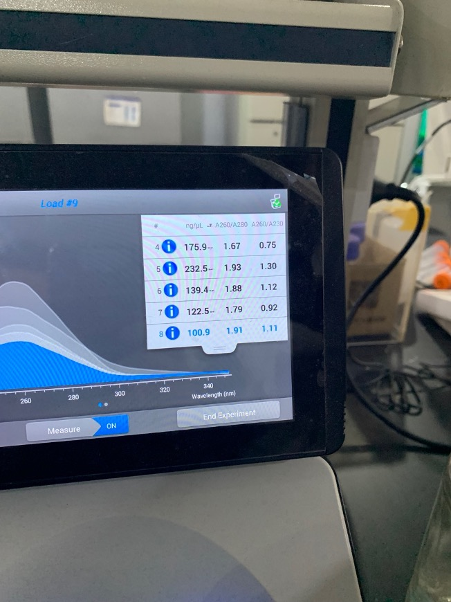

# Extract DNA from mycelium

experimental method

1. Take a small piece of mycelium from the cultured mycelium and put it into a 1.5mL centrifuge tube.

> 
>
> Bacterial cake, one of the sources of DNA

2. Add 0.5mL of CTAB and chloroform (dangerous goods, controlled because they can make poisons)

> The two reagent bottles in the middle of the screen, CTAB on the left and chloroform on the right

3. Place in a shaker and shake well for 1.5 hours

4. Take 0.5mL of bacterial solution in a 1.5mL centrifuge tube

> 
>
> 
The instructor is transferring the bacterial solution

5. Centrifuge at 4 degrees Celsius and 13,000 rpm for 5 minutes

6. Take 300µL of the supernatant and add 600µL of absolute ethanol

7. Centrifuge at 4 degrees Celsius and 13,000 rpm for 5 minutes.

8. Pour off the liquid, and the DNA is now attached to the wall of the tube.

9. Add 0.5mL 75% ethanol

10. Centrifuge at 4 degrees Celsius and 13,000 rpm for 5 minutes

11. Discard the liquid

12. Add 0.5mL 75% ethanol

13. Centrifuge at 4 degrees Celsius and 13,000 rpm for 5 minutes.

14. Discard the liquid

15. Dry centrifuge tubes

16. Add 30µL deionized water (further purified distilled water) and shake to rinse the tube wall

17. Take 10µL of liquid and drop it on the spectrophotometer for measurement.

> 
>
> 
Spectrophotometer in measurement

>
> 
>
> 
I try to operate

>
> 
>
> Partial measurement results show that the quality of DNA extraction is qualified