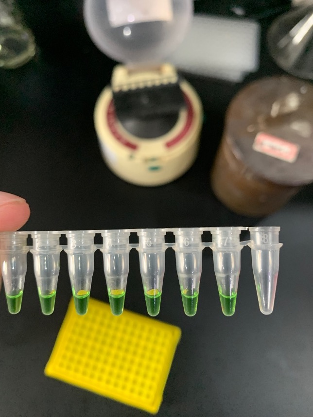
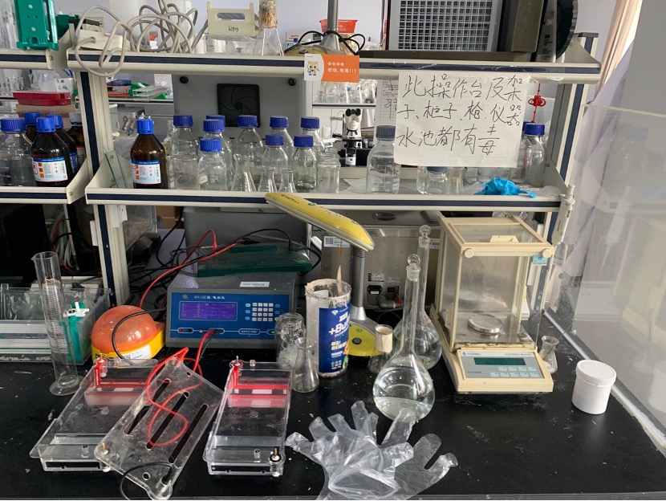
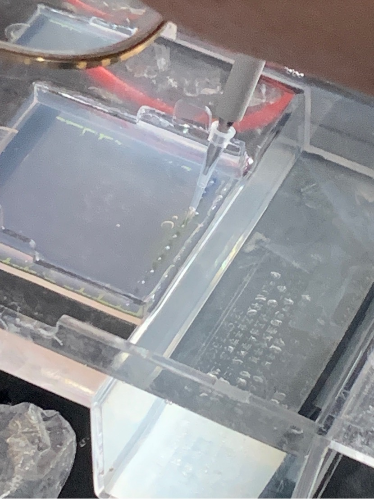
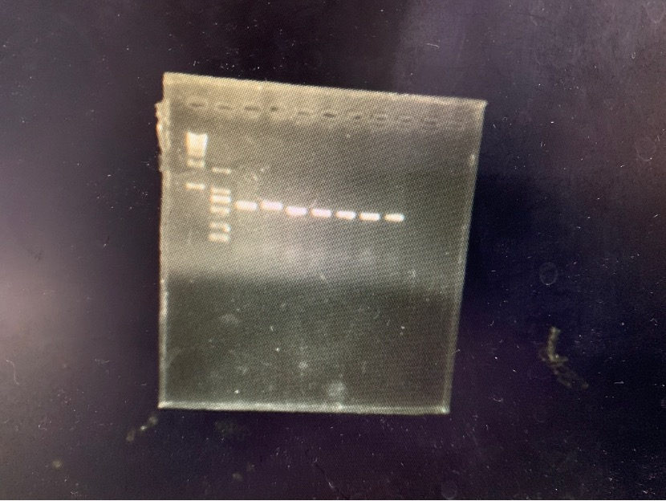

# Analysis of PCR products and agarose gel electrophoresis detection

The target DNA is its gene in the DNA product of the same fungal sample extracted in the last experiment (5.13)

1. Operation

Each DNA needs to add 2µL of DNA sample, 8.5µL of mixed enzyme and other buffers (mix), 12.5µL of deionized water, and 1µL of upstream and downstream primers. For a total of 7 samples, mix other components except the DNA sample into one Mix the universal solution in parts. To ensure sufficient quantity, prepare 8 parts. That is, mix 68µL, primer 8µL, and deionized water 100µL. Prepare it in a 1.5mL centrifuge tube and mix it in a small centrifuge and shaker for later use.

2. Operation

Take 23µL of the mixed universal solution into 7 PCR tubes, and add 7 types of DNA fragments in order. Mix well.

3. PCR amplification

| Predenaturation | Denaturation | Annealing | Extension | Extension | Insulation |
| ------ | -------------------------- | ---- | ---- | -- --- | ---- |
| 91°C | 91°C | 55°C | 72°C | 72°C | 4°C |
| 5min | 30s | 30s | 45s | 10min | / |
| | Repeat 30-35 times (this experiment took 33 times) | | | | |

It is expected to take 90-100 minutes, during which the agarose gel will be produced.

4. Make agarose gel

Add 25 mL of TAB electrophoresis buffer to 0.25 g of agar powder, and heat it in a microwave for 1 minute to melt the agar. Add a drop of dye for easy observation. Pour it into the mold box and insert the "comb" for opening holes to facilitate parallelism. Add measurement sample

Pour the liquid into the opening of the agar gel, place the control solution in the opening next to it and place it in the electrophoresis device

> Voltage 150V, current 200mA, time 20 minutes
>

Take out the completed liquid and gel together and place them in a gel imager for observation

The experiment was quite successful. The DNA extracted from the same species of bacteria was very similar, and the band positions displayed were very close.

This batch of sample DNA can be sent to biological companies for further sequencing and analysis.