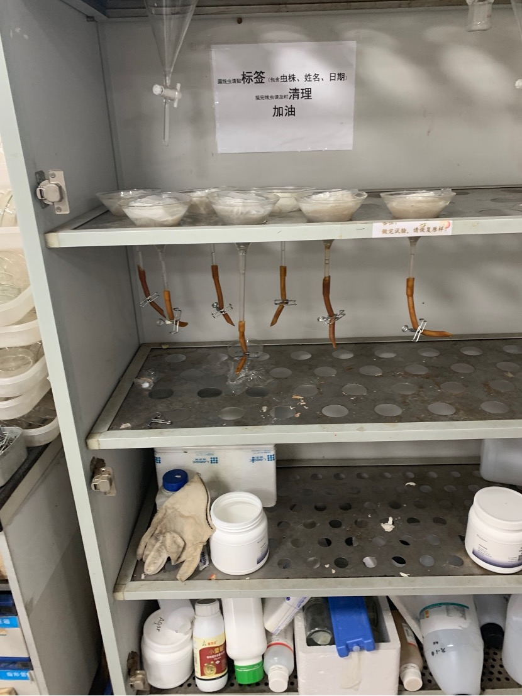

# Learned some basic operations

## Inoculation with Botrytis cinerea

Botrytis cinerea is the main food of pine wood nematode and is used to culture pine wood nematode in the laboratory.

Punch the petri dish with Botrytis cinerea with a hole punch, use a scalpel or a needle to pick up a small piece of mycelium, place it upside down on a clean and uncontaminated PDA culture medium, and place the inoculated culture medium on it. Culture in the incubator, wait until Botrytis cinerea grows completely, and then inoculate pine wood nematode on this medium

Perforated Botrytis cinerea medium for inoculation

Completed inoculated PDA culture medium

## Isolate pine wood nematode from the culture medium

After the pine wood nematode eats the culture medium and Botrytis cinerea, it needs to be isolated for subsequent experiments.

Cut the culture medium in the petri dish crosswise, use a 1mL pipette tip to pick it up, place it on two napkins, put 3-4 culture media on the two napkins, and then wrap them with napkins. Soak in a funnel filled with clean water with the bottom blocked. There may be pine wood nematode residues on the lid of the petri dish. You should wash it with clean water and pour it into the previous funnel. If there is still a petri dish with more residues, lid, turn it upside down on the funnel and paper ball

Funnel separating nematodes
