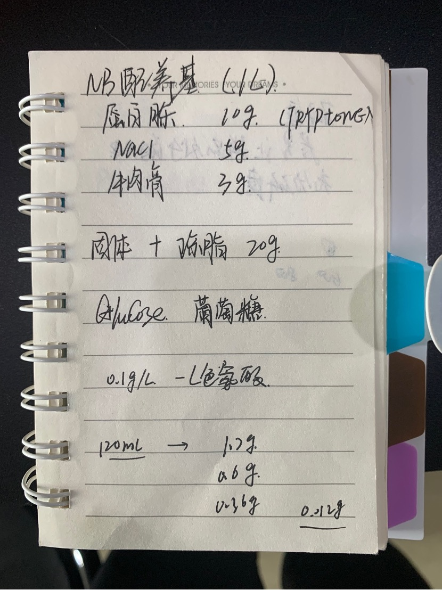
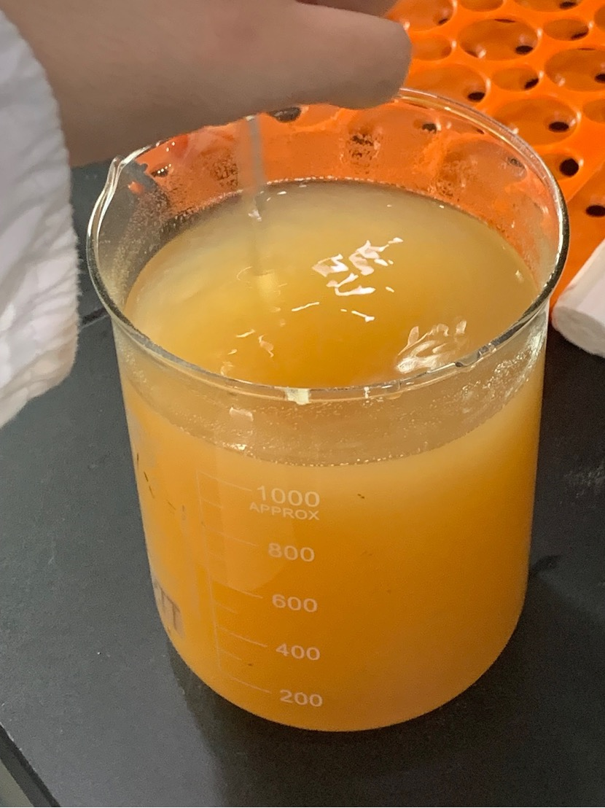
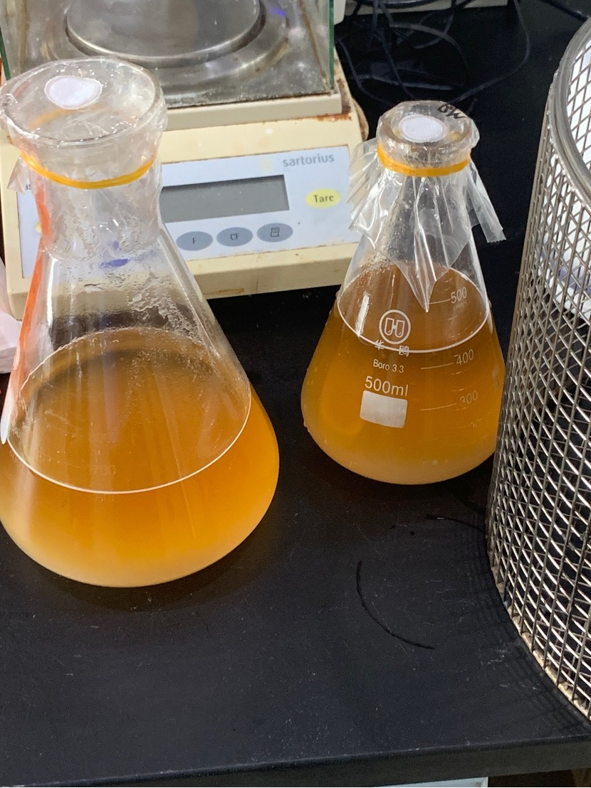

# Preparation of NB culture medium

NB medium is suitable for culturing various bacteria (1L)

The main materials are:

> Peptone 10g
>
>NaCl 5g
>
> Beef paste 3g
>
> Agar 20g

>

Mixed medium

>Put the prepared culture medium into a flask, seal it, and place it in an autoclave at 121 degrees Celsius for 25 minutes to sterilize.

>After sterilization is completed, pour it into a petri dish and wait for solidification. Pay attention to prevent contamination during the process.