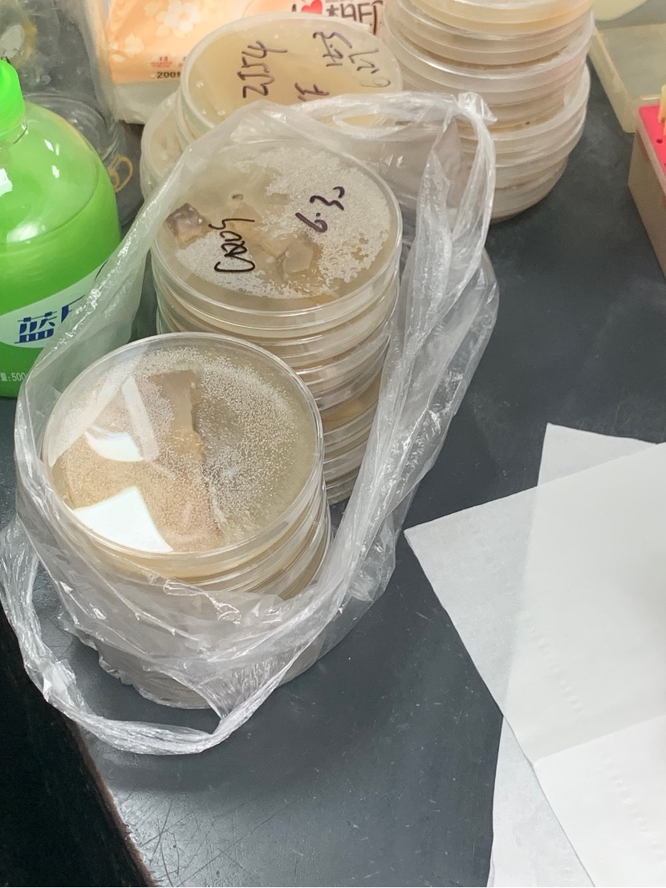
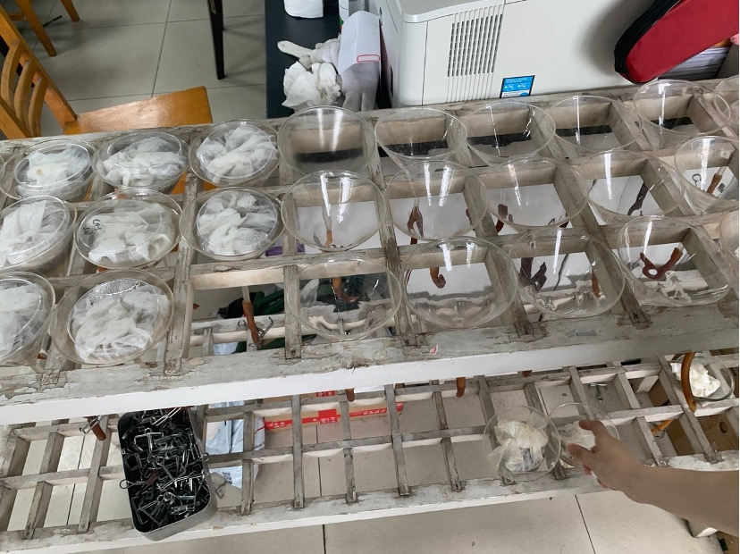
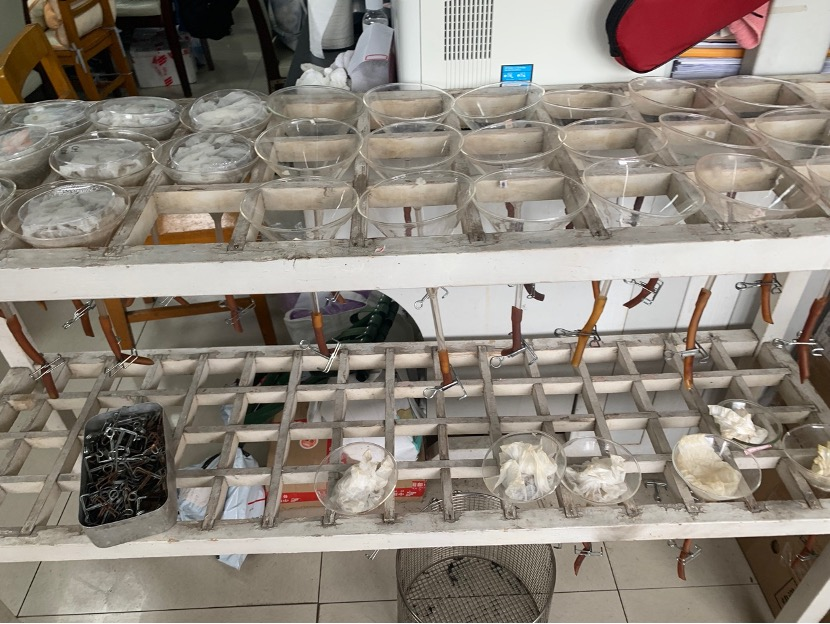
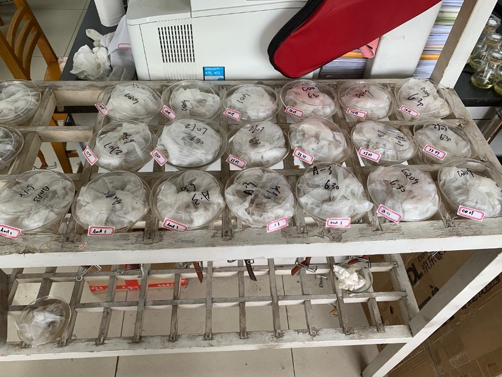
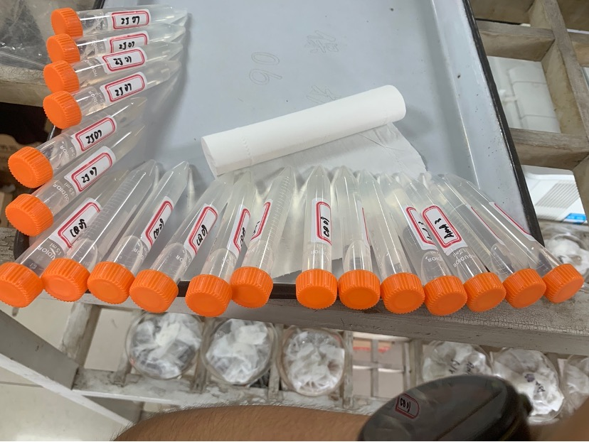
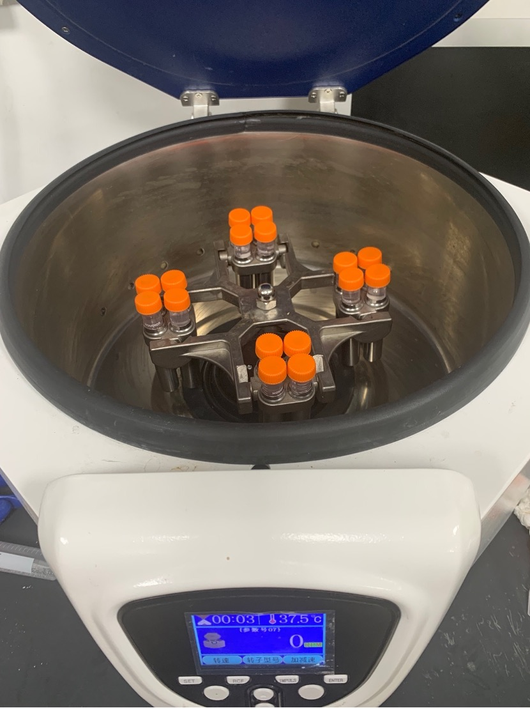
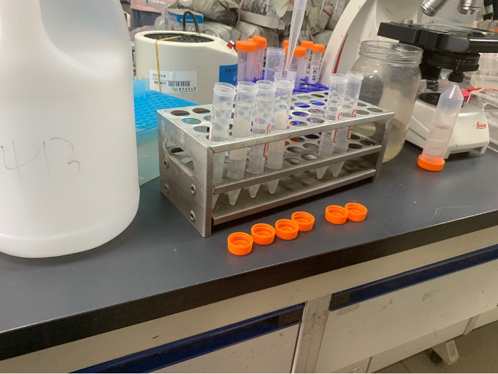
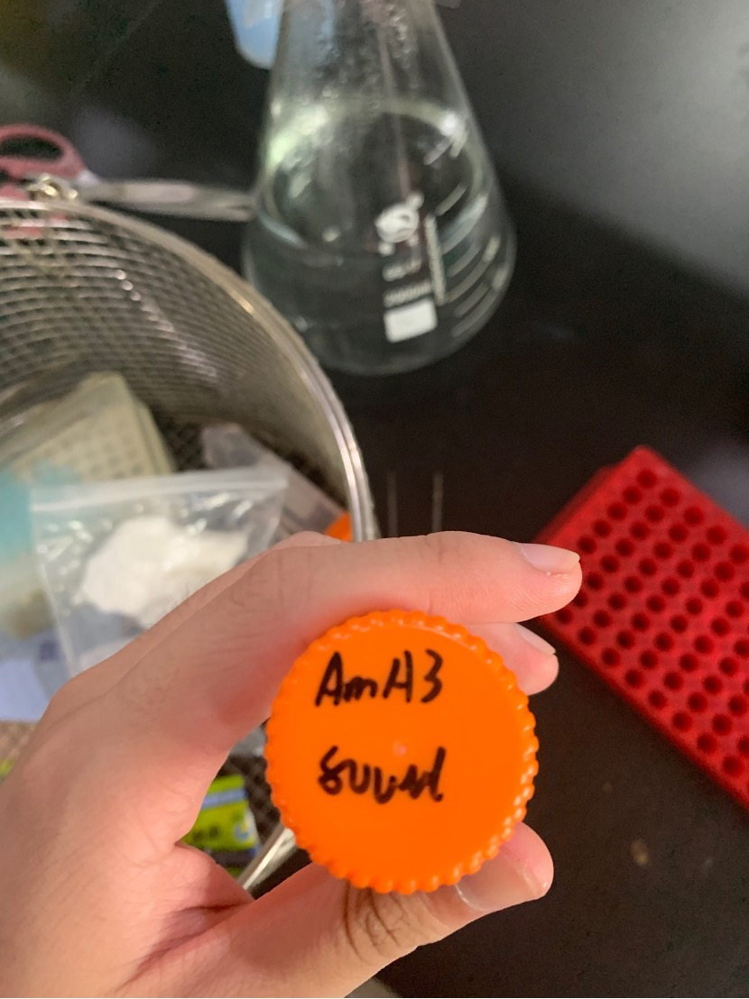
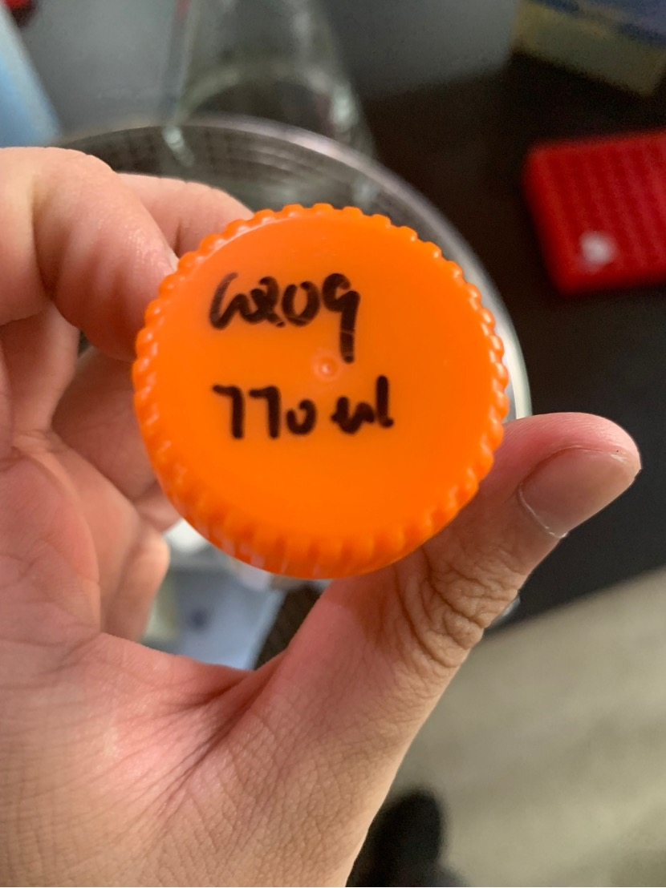

# 1. Preparing pine wood nematode for experimental inoculation

Take out the cultured petri dish from the incubator. The Botrytis cinerea previously cultured in the petri dish has been completely eaten. The pine wood nematode samples this time come from three batches: CQ09; ZJ07; AmA3

 center>Some Petri dishes of CQ09

Operation: After disinfecting the operating table, spread a few napkins on the table, scrape off the gel-like culture medium in the petri dish with the tip of the pipette, spread it on the napkin and wrap it, and then put it with a rubber tube underneath. and was clamped into the funnel

The funnel on the right is sterilized and used for this experiment.

The rubber tubes under the funnel are clamped

Add autoclaved water to the funnel and set aside

Place the wrapped petri dish and napkin in the funnel, rinse the lid of the petri dish with sterilized water and pour it into the corresponding funnel. Be careful not to contaminate each other. Finally, use a batch marked with pine wood nematode. The petri dish lid is placed on top of the paper bag

Funnel draining nematodes

Label each funnel with the nematode batch marked and wait three hours

The completed funnel is ready for the next step.

Use a 15mL centrifuge tube to connect 13-14mL of insect solution in the funnel. Attach the label next to the funnel to the centrifuge tube, being careful not to contaminate each other.

A total of 19 centrifuge tubes completed

At this time, there are many impurities such as viruses on nematodes in the worm liquid, so it is necessary to rinse in advance and add clean water again, observe the nematodes settling below, and mix some worm liquids from the same batch with less worms to form 16 centrifuge tubes

Put all 16 centrifuge tubes into a high-speed centrifuge and centrifuge for 180 seconds, then take them out and take out the supernatant.

Centrifuge tubes ready for centrifugation

Removing serum

Take out 20µL of the completed worm liquid and count the worms in the worm liquid under a microscope. Count the worms at least twice and calculate the average number to get the approximate number of nematodes in the entire tube. Then perform calculations to get the number of nematodes in each batch. The approximate volume of sample required to remove 3,000 worms

AmA3 3000 worms require 800µL insect solution

CQ09 requires 770µL

ZJ07 requires 1040µL

