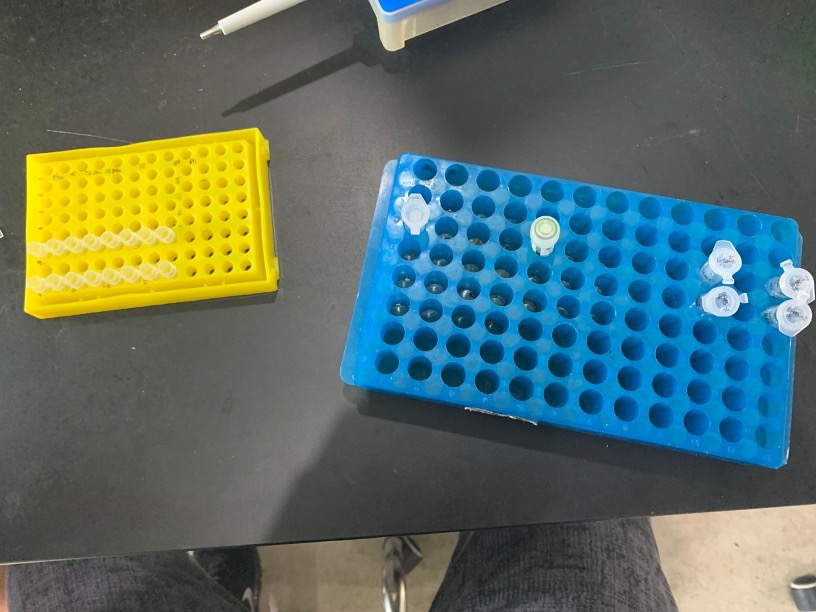
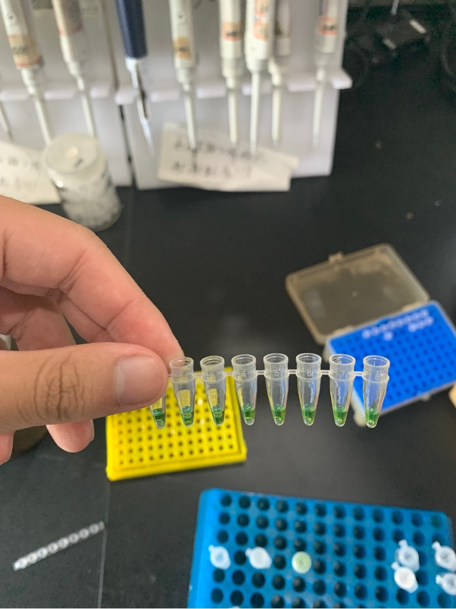
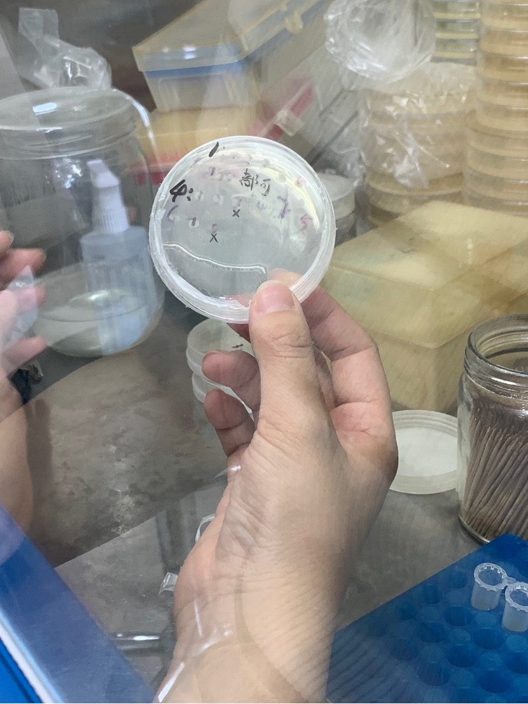
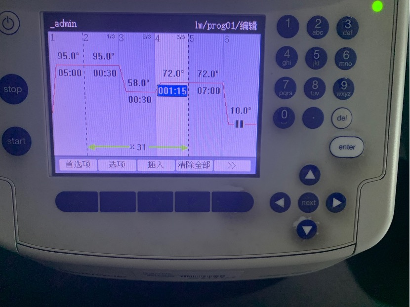
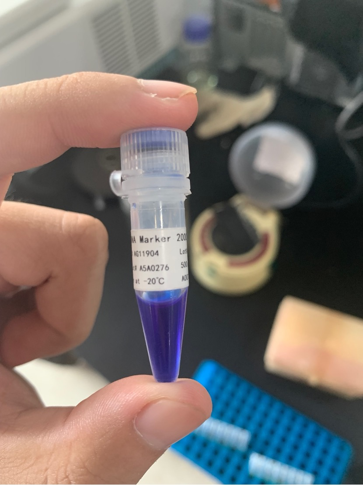
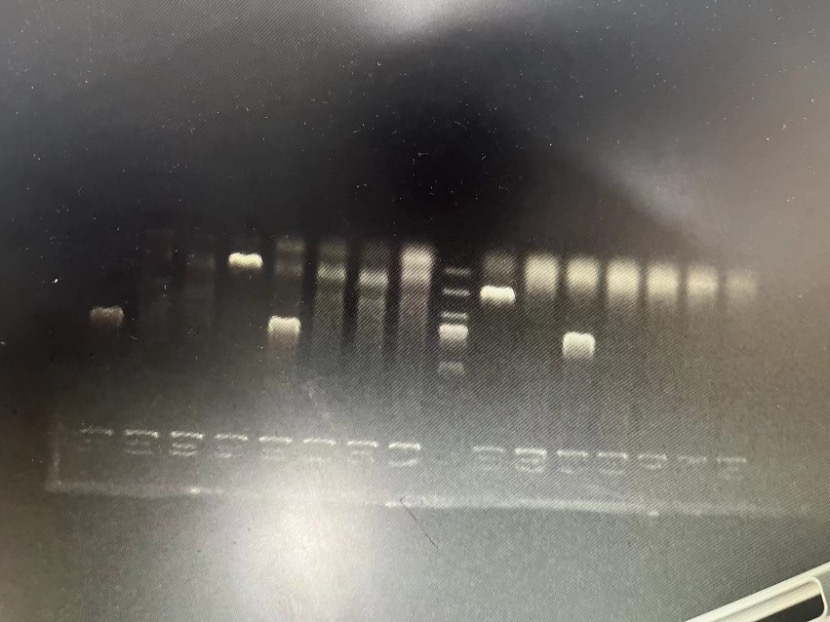

# Perform PCR reaction and genetic analysis

All experiments this time were completed by me under the guarantee of a graduate student

Materials: GH45 1&2 primers, including F and R

mixed enzyme

Sterile water

- Enzyme 90µL, one portion is 10µL, a total of two systems, one system is divided into 8 portions of 10µL, a total of 180µL

- One system of water is 63, add 7µL in one portion, totaling 126µL

- 9µL each of 1R and 1F, 1µL aliquot for one system

- 2R and 2F plus another system

- Mix the above materials in a 2mL centrifuge tube according to the system

- In two eight-strip tubes, add 19µL of the mixture to each tube

The amplified DNA this time came from cultured bacteria, not the previous DNA sample

The cultured bacteria can be seen marked with serial numbers.

Dip the toothpicks in order on a super clean workbench, insert them into the tubes one by one, rotate them and then take them out and throw them away.

Add to the eight joint tubes in order

Close the lid and put it into the PCR machine

This amplification procedure

Make agarose gel

0.5g agar powder

50mL 1xTAE

Evenly heat in microwave for two minutes

After taking it out, add two drops of red nucleic acid dye

Pour into the mold and wait for 1.5 hours until the gel is completely solidified and the amplification process is completed.

This time, DNA Marker 2000 is used for comparison.

The final result was not ideal, but there were no major operational errors.

The one in the middle is Marker, and there are only 3 valid results on both sides.