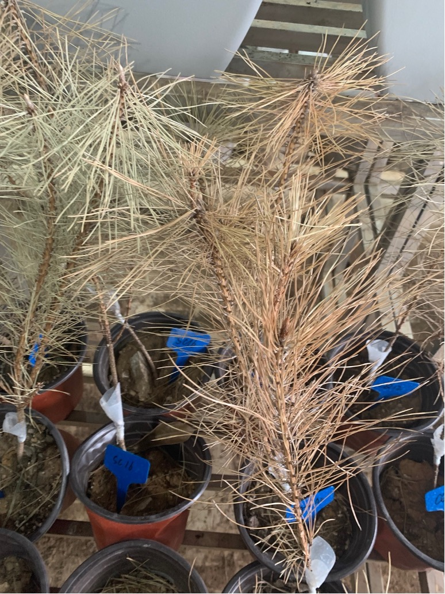

## 实验室实践记录

# 林木种植温室(14:30-17:00)

## 1.  观察成长中的实验松树苗

1. 学习认识马尾松和黑松树

马尾松松针柔软并放射状发散,易受到松材线虫感染

黑松松针更直更扎手,生长较为规整,极易受到松材线虫感染

培养的实验用黑松树苗,目前生长一年多

 

校园内的黑松介绍牌

2. 观察患病的松树了解松材线虫病的各个阶段症状

松材线虫病发病初期,松针会失去绿色

之后松针和周围树皮会变为黄色,树上会有天牛和天牛产卵痕迹

后期松树将完全不分泌松脂并且松针变成火烧的红色

患病的松树会在两个月内枯死

 

实验时人工患病枯死的黑松苗

3. 了解如何向松树苗人工注入松材线虫

在树上开一个2-3cm的开口,开到形成层即可不要划开芯材,不然树苗可能容易折断

在开口处固定一块棉球,在外面包裹塑料薄膜

在棉球中滴加有预定松材线虫数量的虫液

为树苗浇水,注意直接向土中加入不要浇在树干和松针上

第二天向棉球里面加入无菌水

两天向患病树浇水一次,每天观察一次患病树的情况

在特定的日子砍倒树苗取样观察

 

## 2.  学习部分DNA分析理论知识

1. Ct数值:在人工扩增时需要循环多少次使得表达量趋于峰顶不再陡增

Ct值越小,在扩增DNA时表达量会更早开始快速上升,最终的表达量也会高一些

2. 溶解温度:目标基因(c DNA)在多少温度下达到最大溶解量

如果这个温度小于80摄氏度则说明出现了引物自连(本来应该附着在目标基因两侧的引物片段发生了自身粘连的情况形成了一些在30bp左右的短序列)

如果这个温度高于85摄氏度则说明有其他基因组的污染,此时应该用到称作“去g DNA”的操作

3. 一般将actin基因(肌动蛋白)作为实验的内参基因(用于和目的基因对照)
4. 设置数据上的对照组(如在松材线虫染病实验中未接种虫的是对照组(ck),接种后的是处理组)
