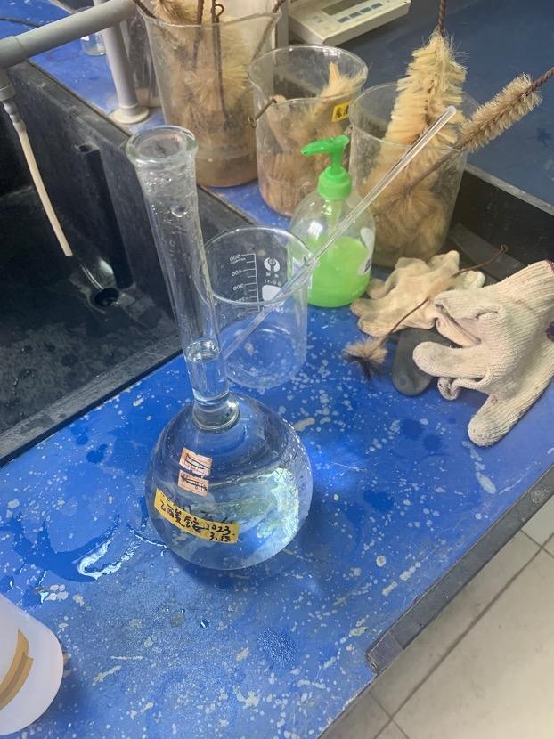

# 3.18 微生物实验室(14:30-17:30)

## 1.  配制1mol/L 的乙酸铵溶液

- 称量77.08g乙酸铵固体(有挥发性)

- 加入400mL水中使之完全溶解

- 将液体倒入1L容量瓶中

- 用蒸馏水润洗溶解时使用的烧杯7次

- 将容量瓶加到刻度线后用封口膜封口

- 搅拌均匀

实验操作介绍页

配制好的乙酸铵溶液

## 2.  配制10mol/L的氢氧化钠溶液

- 称量400g氢氧化钠固体(危险,应当戴手套操作)

- 加入500mL水中使之完全溶解并恢复到室温

- 将液体倒入1L容量瓶中

- 用蒸馏水润洗溶解时使用的烧杯7次

- 将容量瓶加到刻度线后用封口膜封口
1. 搅拌均匀

未溶解完毕的氢氧化钠溶液

## 3.  配制固态培养基

### 实验目的:研究核黄素(维生素B2)浓度对于被孢霉真菌生长的影响

#### 前期准备:配制固态培养基

资料搜集:核黄素摩尔质量为376.37g/mol

母液配制:0.1mol/L的核黄素溶液10mL

- 称量3.76g核黄素

- 加8mL水溶解

- 加入2mL稀氢氧化钠溶液加速溶解

- 溶解后为深黄色溶液

浓度梯度:10-3 , 10-4, 10-5, 10-6,10-7mol/L

定量计算:C1V1=C2V2

计算时候的草稿

| 浓度mol/L | /(对照组) | 10-3 | 10-4  | 10-5   | 10-6    | 10-7        |
| ------- | ------ | ---- | ----- | ------ | ------- | ----------- |
| 母液添加量   | /      | 1mL  | 0.1mL | 0.01mL | 0.001mL | 10mL的10-6溶液 |

10-7mol/L时所需的母液容积小于移液枪的最小量程,所以使用10-6mol/L的溶液稀释十倍

配制培养基共计600mL

- 切生马铃薯120g以上

- 洗净削皮切碎成小块

- 在锅中加入600mL以上的水煮烂马铃薯

- 加入120g葡萄糖粉末溶解

- 用纱布过滤后倒入大烧杯(塑料)中

- 用量筒分别取100mL培养基液体到共计6只锥形瓶中

- 分别加入先前运算好的数量的核黄素

- 分别加入1.00g的琼脂粉以便于形成固态培养基

- 分别封口加入高压灭菌锅121摄氏度20分钟
